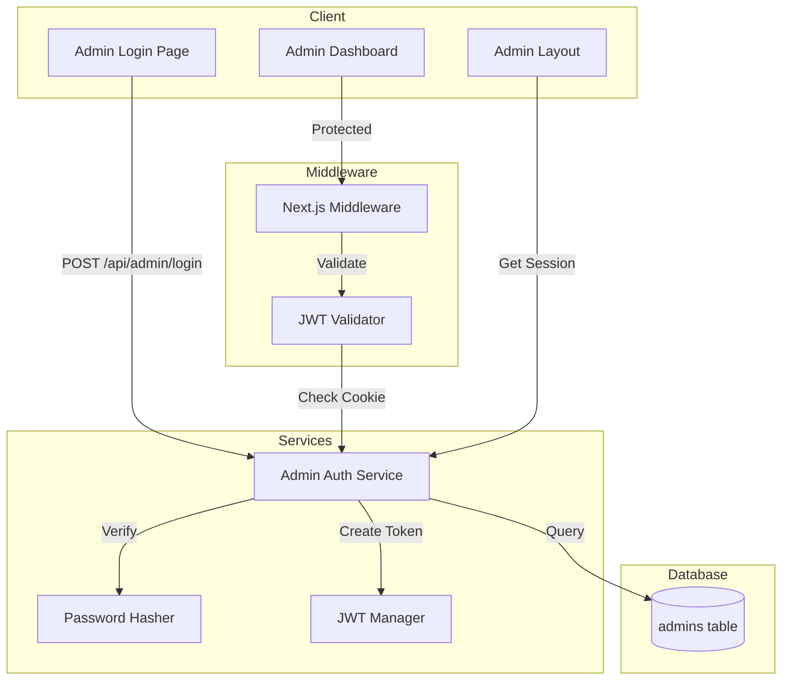

# Design Document: Admin Authentication Separation

## Overview

This design implements a dedicated authentication system for admin users, completely independent from the regular Supabase Auth system. The solution uses JWT tokens stored in httpOnly cookies for session management, bcrypt for password hashing, and a dedicated `admins` database table for credential storage.

The architecture follows a layered approach:
1. **Database Layer**: `admins` table with RLS policies
2. **Service Layer**: Admin auth service for authentication logic
3. **Middleware Layer**: Route protection via Next.js middleware
4. **Presentation Layer**: Admin login page and layout components

## Architecture



## Components and Interfaces

### 1. Admin Auth Service (`src/lib/services/admin-auth.service.ts`)

Core service handling all admin authentication operations.

```typescript
interface AdminUser {
  id: string;
  email: string;
  isActive: boolean;
}

interface AdminSession {
  admin: AdminUser;
  expiresAt: number;
}

interface LoginResult {
  success: boolean;
  error?: string;
}

// Validates admin credentials and creates session
async function loginAdmin(email: string, password: string): Promise<LoginResult>;

// Verifies JWT token and returns admin session
async function verifyAdminSession(token: string): Promise<AdminSession | null>;

// Creates JWT token for admin
function createAdminToken(admin: AdminUser): string;

// Clears admin session cookie
async function logoutAdmin(): Promise<void>;

// Gets current admin from request cookies
async function getAdminFromRequest(): Promise<AdminUser | null>;

// Helper for server actions - throws if not authenticated
async function requireAdmin(): Promise<AdminUser>;
```

### 2. Password Utilities (`src/lib/utils/password.ts`)

```typescript
// Hash password with bcrypt (12 rounds)
async function hashPassword(password: string): Promise<string>;

// Verify password against hash
async function verifyPassword(password: string, hash: string): Promise<boolean>;

// Validate password meets requirements (8+ chars, 1 uppercase, 1 number)
function validatePasswordStrength(password: string): { valid: boolean; error?: string };
```

### 3. JWT Utilities (`src/lib/utils/jwt.ts`)

```typescript
interface JWTPayload {
  sub: string;      // admin id
  email: string;
  iat: number;      // issued at
  exp: number;      // expires at (8 hours)
}

// Sign JWT with ADMIN_JWT_SECRET
function signToken(payload: Omit<JWTPayload, 'iat' | 'exp'>): string;

// Verify and decode JWT
function verifyToken(token: string): JWTPayload | null;
```

### 4. Admin Repository (`src/lib/db/repositories/admins.repository.ts`)

```typescript
interface AdminRecord {
  id: string;
  email: string;
  password_hash: string;
  is_active: boolean;
  last_login_at: string | null;
  failed_login_attempts: number;
  locked_until: string | null;
  created_at: string;
  updated_at: string;
}

// Find admin by email
async function findByEmail(email: string): Promise<AdminRecord | null>;

// Update last login timestamp and reset failed attempts
async function recordSuccessfulLogin(id: string): Promise<void>;

// Increment failed login attempts
async function recordFailedLogin(id: string): Promise<number>;

// Lock account for 15 minutes
async function lockAccount(id: string): Promise<void>;

// Check if account is locked
function isAccountLocked(admin: AdminRecord): boolean;

// Create or update admin (for setup script)
async function upsertAdmin(email: string, passwordHash: string): Promise<AdminRecord>;
```

### 5. Middleware Integration

The existing middleware will be extended to handle admin routes separately:

```typescript
// In src/middleware.ts
async function middleware(request: NextRequest) {
  const pathname = request.nextUrl.pathname;
  
  // Handle admin routes with separate auth
  if (pathname.startsWith('/admin')) {
    // Skip login page
    if (pathname === '/admin/login') {
      // If already authenticated, redirect to dashboard
      const adminSession = await getAdminSessionFromCookie(request);
      if (adminSession) {
        return NextResponse.redirect(new URL('/admin/dashboard', request.url));
      }
      return NextResponse.next();
    }
    
    // Validate admin session for all other admin routes
    const adminSession = await getAdminSessionFromCookie(request);
    if (!adminSession) {
      return NextResponse.redirect(new URL('/admin/login', request.url));
    }
    
    // Check if admin is active
    if (!adminSession.admin.isActive) {
      return NextResponse.redirect(new URL('/admin/login', request.url));
    }
    
    return NextResponse.next();
  }
  
  // Continue with existing Supabase auth for non-admin routes
  // ... existing code
}
```

### 6. API Routes

#### POST `/api/admin/login`

```typescript
// Request body
interface LoginRequest {
  email: string;
  password: string;
}

// Response
interface LoginResponse {
  success: boolean;
  error?: string;
}

// Sets httpOnly cookie on success
```

#### POST `/api/admin/logout`

```typescript
// No request body needed
// Clears admin_session cookie
// Returns redirect to /admin/login
```

### 7. Admin Login Page (`src/app/admin/login/page.tsx`)

Client component with:
- Email input with validation
- Password input
- Submit button with loading state
- Error message display
- Admin-specific branding (distinct from user login)

### 8. Updated Admin Layout (`src/app/admin/layout.tsx`)

Server component that:
- Reads admin session from cookie
- Displays admin email
- Provides logout button
- Removes all Supabase Auth dependencies

### 9. Admin Dashboard (`src/app/admin/dashboard/page.tsx`)

Server component that displays key platform statistics and recent activity.

```typescript
interface DashboardStats {
  totalTools: number;
  totalCategories: number;
  totalAiNews: number;
}

interface RecentTool {
  id: string;
  name: string;
  slug: string;
  created_at: string;
}

// Fetches dashboard statistics from database
async function getDashboardStats(): Promise<DashboardStats>;

// Fetches 5 most recently added tools
async function getRecentTools(): Promise<RecentTool[]>;
```

Dashboard displays:
- Total tools count card
- Total categories count card
- Total AI news articles count card
- List of 5 most recently added tools with links to edit
- Quick action buttons for common admin tasks

### 10. Admin Dashboard Service (`src/lib/services/admin-dashboard.service.ts`)

```typescript
// Get total count of tools
async function getToolsCount(): Promise<number>;

// Get total count of categories
async function getCategoriesCount(): Promise<number>;

// Get total count of AI news articles
async function getAiNewsCount(): Promise<number>;

// Get N most recently created tools
async function getRecentTools(limit: number): Promise<RecentTool[]>;
```

## Data Models

### Admins Table Schema

```sql
CREATE TABLE admins (
  id UUID PRIMARY KEY DEFAULT gen_random_uuid(),
  email VARCHAR(255) UNIQUE NOT NULL,
  password_hash VARCHAR(255) NOT NULL,
  is_active BOOLEAN DEFAULT true,
  last_login_at TIMESTAMPTZ,
  failed_login_attempts INTEGER DEFAULT 0,
  locked_until TIMESTAMPTZ,
  created_at TIMESTAMPTZ DEFAULT now(),
  updated_at TIMESTAMPTZ DEFAULT now()
);

-- Unique index on email for fast lookups
CREATE UNIQUE INDEX idx_admins_email ON admins(email);

-- RLS: Only service role can access
ALTER TABLE admins ENABLE ROW LEVEL SECURITY;

CREATE POLICY "Service role only" ON admins
  FOR ALL
  USING (auth.role() = 'service_role');

-- Updated_at trigger
CREATE TRIGGER set_admins_updated_at
  BEFORE UPDATE ON admins
  FOR EACH ROW
  EXECUTE FUNCTION update_updated_at_column();
```

### JWT Token Structure

```typescript
{
  sub: "uuid-of-admin",           // Admin ID
  email: "admin@example.com",     // Admin email
  iat: 1703721600,                // Issued at (Unix timestamp)
  exp: 1703750400                 // Expires at (8 hours later)
}
```

### Cookie Configuration

```typescript
{
  name: 'admin_session',
  value: '<jwt-token>',
  httpOnly: true,
  secure: true,                   // HTTPS only in production
  sameSite: 'strict',
  path: '/admin',                 // Only sent to admin routes
  maxAge: 8 * 60 * 60            // 8 hours in seconds
}
```


## Correctness Properties

*A property is a characteristic or behavior that should hold true across all valid executions of a system—essentially, a formal statement about what the system should do. Properties serve as the bridge between human-readable specifications and machine-verifiable correctness guarantees.*

### Property 1: Email Uniqueness Constraint

*For any* two admin records with the same email address, the database SHALL reject the second insert with a unique constraint violation.

**Validates: Requirements 1.3**

### Property 2: Password Hashing Format

*For any* password string, when hashed by the Admin_System, the resulting hash SHALL be a valid bcrypt hash with cost factor of at least 12.

**Validates: Requirements 1.4**

### Property 3: Email Format Validation

*For any* string input to the email field, the Admin_System SHALL accept only strings matching the standard email regex pattern `^[^\s@]+@[^\s@]+\.[^\s@]+$` and reject all others before making database queries.

**Validates: Requirements 2.6, 8.1**

### Property 4: Password Strength Validation

*For any* password string, the Admin_System SHALL accept only passwords with at least 8 characters, at least 1 uppercase letter, and at least 1 number, rejecting all others with a descriptive error.

**Validates: Requirements 6.4**

### Property 5: Successful Login Flow

*For any* valid admin credentials (correct email and password for an active, non-locked account), the Admin_System SHALL:
- Create a JWT token containing the admin's id and email
- Set an httpOnly, secure, sameSite=strict cookie named `admin_session`
- Set the token expiry to exactly 8 hours from creation
- Update `last_login_at` to current timestamp
- Reset `failed_login_attempts` to 0

**Validates: Requirements 2.2, 2.7, 3.1, 3.2, 3.3, 3.4**

### Property 6: Failed Login Error Handling

*For any* invalid credentials (wrong email or wrong password), the Admin_System SHALL:
- Return the generic error message "Invalid email or password"
- Increment `failed_login_attempts` by exactly 1
- Never reveal whether the email exists or the password was wrong

**Validates: Requirements 2.3, 5.1, 8.4**

### Property 7: Account Lockout Mechanism

*For any* admin account:
- When `failed_login_attempts` reaches exactly 5, `locked_until` SHALL be set to current time plus 15 minutes
- While `locked_until` > current time, all login attempts SHALL fail with "Account temporarily locked. Try again later."
- When `locked_until` expires and login succeeds, both `failed_login_attempts` and `locked_until` SHALL be reset

**Validates: Requirements 5.2, 5.3, 5.4**

### Property 8: JWT Signature Validation

*For any* JWT token, the Admin_System SHALL:
- Accept tokens signed with the correct `ADMIN_JWT_SECRET` and not expired
- Reject tokens with invalid signatures
- Reject tokens that have expired (exp < current time)

**Validates: Requirements 3.6**

### Property 9: Route Protection

*For any* request to `/admin/*` routes (except `/admin/login`):
- Without a valid `admin_session` cookie, redirect to `/admin/login`
- With a valid `admin_session` cookie for an active admin, allow access
- With an expired or invalid token, redirect to `/admin/login`

**Validates: Requirements 4.1, 4.2, 4.3**

### Property 10: Inactive Account Denial

*For any* admin account where `is_active` is false, the Admin_System SHALL deny access to all admin routes and redirect to `/admin/login`, regardless of valid session token.

**Validates: Requirements 4.5**

### Property 11: Authenticated Admin Login Redirect

*For any* request to `/admin/login` with a valid `admin_session` cookie, the Admin_System SHALL redirect to `/admin/dashboard`.

**Validates: Requirements 2.4**

### Property 12: Logout Session Clearing

*For any* logout action, the Admin_System SHALL clear the `admin_session` cookie and redirect to `/admin/login`.

**Validates: Requirements 3.5, 7.1, 7.2**

### Property 13: Recent Tools Ordering

*For any* set of tools in the database, the Admin_Dashboard SHALL display exactly the 5 tools with the most recent `created_at` timestamps, ordered from newest to oldest.

**Validates: Requirements 10.4**

### Property 14: Server Action Protection

*For any* call to a protected server action without a valid Admin_Session, the Admin_System SHALL throw an unauthorized error.

**Validates: Requirements 11.2**

### Property 15: Admin Upsert Idempotence

*For any* email and password combination, running the setup script SHALL:
- Create a new admin if no admin with that email exists
- Update the password hash if an admin with that email already exists
- Result in exactly one admin record with that email

**Validates: Requirements 6.2, 6.3**

### Property 16: Dashboard Statistics Accuracy

*For any* state of the database, the Admin_Dashboard SHALL display:
- The exact count of rows in the `tools` table as total tools
- The exact count of rows in the `categories` table as total categories
- The exact count of rows in the `ai_news` table as total AI news articles

**Validates: Requirements 10.1, 10.2, 10.3**

## Error Handling

### Authentication Errors

| Error Condition | User Message | HTTP Status | Logging |
|----------------|--------------|-------------|---------|
| Invalid credentials | "Invalid email or password" | 401 | Log attempt (no PII) |
| Account locked | "Account temporarily locked. Try again later." | 423 | Log with admin ID |
| Account inactive | Redirect to login | 302 | Log with admin ID |
| Invalid/expired token | Redirect to login | 302 | Log token expiry |
| Missing JWT secret | Internal error | 500 | Critical alert |

### Validation Errors

| Error Condition | User Message | HTTP Status |
|----------------|--------------|-------------|
| Invalid email format | "Please enter a valid email address" | 400 |
| Weak password | "Password must be at least 8 characters with 1 uppercase and 1 number" | 400 |
| Missing required field | "Email and password are required" | 400 |

### Database Errors

| Error Condition | User Message | HTTP Status | Logging |
|----------------|--------------|-------------|---------|
| Connection failure | "Unable to connect. Please try again." | 503 | Critical alert |
| Query timeout | "Request timed out. Please try again." | 504 | Warning |
| Constraint violation | "An error occurred. Please try again." | 500 | Error with details |

### Security Logging

All authentication events SHALL be logged for security monitoring:
- Successful logins (admin ID, timestamp, IP)
- Failed login attempts (email hash, timestamp, IP)
- Account lockouts (admin ID, timestamp)
- Unauthorized access attempts (route, timestamp, IP)

Logs SHALL NOT contain:
- Plain text passwords
- Full email addresses (use hash or partial)
- JWT tokens

## Testing Strategy

### Testing Framework

- **Unit Tests**: Vitest (already configured in project)
- **Property-Based Tests**: fast-check (already installed)
- **Integration Tests**: Vitest with Supabase test database

### Dual Testing Approach

Both unit tests and property-based tests are required for comprehensive coverage:

- **Unit tests**: Verify specific examples, edge cases, and error conditions
- **Property tests**: Verify universal properties across all valid inputs

### Property-Based Test Configuration

Each property test MUST:
- Run minimum 100 iterations
- Reference the design document property number
- Use tag format: `Feature: admin-auth-separation, Property N: <property_text>`

### Test File Structure

```
src/lib/services/__tests__/
  admin-auth.service.test.ts           # Unit tests
  admin-auth.service.property.test.ts  # Property tests
  admin-dashboard.service.test.ts      # Unit tests
  admin-dashboard.service.property.test.ts # Property tests

src/lib/utils/__tests__/
  password.test.ts                     # Unit tests
  password.property.test.ts            # Property tests
  jwt.test.ts                          # Unit tests
  jwt.property.test.ts                 # Property tests

src/lib/db/repositories/__tests__/
  admins.repository.test.ts            # Unit tests
  admins.repository.property.test.ts   # Property tests

src/app/admin/__tests__/
  middleware.property.test.ts          # Route protection properties
```

### Test Categories

#### 1. Password Utilities (Properties 2, 4)
- Property: bcrypt hash format validation
- Property: password strength validation rules
- Unit: specific password examples (edge cases)

#### 2. JWT Utilities (Properties 5, 8)
- Property: token structure contains required claims
- Property: signature validation accepts/rejects correctly
- Property: expiry validation
- Unit: specific token scenarios

#### 3. Email Validation (Property 3)
- Property: valid emails accepted, invalid rejected
- Unit: edge cases (unicode, special chars)

#### 4. Login Flow (Properties 5, 6, 7)
- Property: successful login creates correct session
- Property: failed login returns generic error
- Property: lockout triggers at 5 failures
- Unit: specific credential combinations

#### 5. Route Protection (Properties 9, 10, 11)
- Property: unauthenticated requests redirect
- Property: valid sessions allow access
- Property: inactive accounts denied
- Unit: specific route/session combinations

#### 6. Database Operations (Properties 1, 13, 15, 16)
- Property: email uniqueness enforced
- Property: recent tools ordering
- Property: upsert idempotence
- Property: dashboard statistics accuracy
- Unit: specific CRUD operations

### Generators for Property Tests

```typescript
// Email generator
const emailArb = fc.emailAddress();

// Password generator (valid)
const validPasswordArb = fc.tuple(
  fc.stringOf(fc.constantFrom(...'ABCDEFGHIJKLMNOPQRSTUVWXYZ'), { minLength: 1, maxLength: 3 }),
  fc.stringOf(fc.constantFrom(...'0123456789'), { minLength: 1, maxLength: 3 }),
  fc.stringOf(fc.constantFrom(...'abcdefghijklmnopqrstuvwxyz'), { minLength: 4, maxLength: 10 })
).map(([upper, num, lower]) => upper + num + lower);

// Password generator (invalid - too short)
const shortPasswordArb = fc.string({ minLength: 1, maxLength: 7 });

// Admin record generator
const adminRecordArb = fc.record({
  id: fc.uuid(),
  email: fc.emailAddress(),
  is_active: fc.boolean(),
  failed_login_attempts: fc.integer({ min: 0, max: 10 }),
  locked_until: fc.option(fc.date(), { nil: null })
});

// JWT payload generator
const jwtPayloadArb = fc.record({
  sub: fc.uuid(),
  email: fc.emailAddress(),
  iat: fc.integer({ min: 0 }),
  exp: fc.integer({ min: 0 })
});
```

### Test Environment Setup

```typescript
// vitest.setup.ts additions
beforeAll(async () => {
  // Set test JWT secret
  process.env.ADMIN_JWT_SECRET = 'test-secret-key-for-testing-only';
});

// For database tests, use test Supabase instance
// or mock the Supabase client
```
