# Design Document: Admin Panel CRUD

## Overview

This design document describes the architecture and implementation approach for a comprehensive admin panel providing full CRUD operations for all 11 database tables in the AI Tools Book application. The system follows a modular, component-based architecture using Next.js App Router with React Server Components and Client Components where interactivity is needed.

The admin panel will be built on top of the existing infrastructure:
- Supabase for database and authentication
- Existing repository pattern in `src/lib/db/repositories/`
- Admin authentication via JWT tokens (`admin-auth.service.ts`)
- TypeScript for type safety throughout

## Architecture

### High-Level Architecture

```mermaid
graph TB
    subgraph "Client Layer"
        AdminLayout[Admin Layout]
        Sidebar[Admin Sidebar]
        DataTable[Data Table Component]
        FormBuilder[Form Components]
        GlobalSearch[Global Search]
    end
    
    subgraph "Page Layer"
        Dashboard[Dashboard Page]
        ToolsPages[Tools Pages]
        NewsPages[News Pages]
        PromptsPages[Prompts Pages]
        TaxonomyPages[Taxonomy Pages]
        FeaturedPages[Featured Pages]
        FAQPages[FAQ Pages]
        AdminsPages[Admins Pages]
        UserActivityPage[User Activity Page]
    end
    
    subgraph "Service Layer"
        AdminDashboard[Admin Dashboard Service]
        ToolsService[Tools Service]
        NewsService[News Service]
        PromptsService[Prompts Service]
        CategoriesService[Categories Service]
        FeaturedService[Featured Service]
        FAQService[FAQ Service]
        AdminsService[Admins Service]
    end
    
    subgraph "Repository Layer"
        ToolsRepo[Tools Repository]
        NewsRepo[AI News Repository]
        PromptsRepo[Prompts Repository]
        CategoriesRepo[Categories Repository]
        SubcategoriesRepo[Subcategories Repository]
        CategoryGroupsRepo[Category Groups Repository]
        FeaturedRepo[Featured Tools Repository]
        FAQRepo[FAQs Repository]
        AdminsRepo[Admins Repository]
        FavoritesRepo[User Favorites Repository]
    end
    
    subgraph "Database"
        Supabase[(Supabase PostgreSQL)]
    end
    
    AdminLayout --> Sidebar
    AdminLayout --> Dashboard
    AdminLayout --> ToolsPages
    AdminLayout --> NewsPages
    AdminLayout --> PromptsPages
    AdminLayout --> TaxonomyPages
    AdminLayout --> FeaturedPages
    AdminLayout --> FAQPages
    AdminLayout --> AdminsPages
    AdminLayout --> UserActivityPage
    
    Dashboard --> AdminDashboard
    ToolsPages --> ToolsService
    NewsPages --> NewsService
    PromptsPages --> PromptsService
    TaxonomyPages --> CategoriesService
    FeaturedPages --> FeaturedService
    FAQPages --> FAQService
    AdminsPages --> AdminsService
    
    ToolsService --> ToolsRepo
    NewsService --> NewsRepo
    PromptsService --> PromptsRepo
    CategoriesService --> CategoriesRepo
    CategoriesService --> SubcategoriesRepo
    CategoriesService --> CategoryGroupsRepo
    FeaturedService --> FeaturedRepo
    FAQService --> FAQRepo
    AdminsService --> AdminsRepo
    AdminDashboard --> FavoritesRepo
    
    ToolsRepo --> Supabase
    NewsRepo --> Supabase
    PromptsRepo --> Supabase
    CategoriesRepo --> Supabase
    SubcategoriesRepo --> Supabase
    CategoryGroupsRepo --> Supabase
    FeaturedRepo --> Supabase
    FAQRepo --> Supabase
    AdminsRepo --> Supabase
    FavoritesRepo --> Supabase
```



### Route Structure

```
/admin
├── /dashboard                    # Dashboard with stats and recent activity
├── /tools                        # Tools list
│   ├── /new                      # Create tool
│   └── /[id]/edit               # Edit tool
├── /news                         # AI News list
│   ├── /new                      # Create news
│   └── /[id]/edit               # Edit news
├── /prompts                      # Prompts list
│   ├── /new                      # Create prompt
│   └── /[id]/edit               # Edit prompt
├── /category-groups              # Category groups list
│   ├── /new                      # Create category group
│   └── /[id]/edit               # Edit category group
├── /categories                   # Categories list
│   ├── /new                      # Create category
│   └── /[id]/edit               # Edit category
├── /subcategories                # Subcategories list
│   ├── /new                      # Create subcategory
│   └── /[id]/edit               # Edit subcategory
├── /featured                     # Featured tools list
│   ├── /new                      # Create featured tool
│   └── /[id]/edit               # Edit featured tool
├── /faqs                         # FAQs list
│   ├── /new                      # Create FAQ
│   └── /[id]/edit               # Edit FAQ
├── /admins                       # Admins list
│   ├── /new                      # Create admin
│   └── /[id]/edit               # Edit admin
└── /user-activity                # User favorites (read-only)
```

## Components and Interfaces

### Core Admin Components

#### AdminSidebar Component

```typescript
// src/components/admin/AdminSidebar.tsx

interface NavGroup {
  label: string;
  items: NavItem[];
}

interface NavItem {
  label: string;
  href: string;
  icon: React.ComponentType;
}

interface AdminSidebarProps {
  currentPath: string;
  adminEmail: string;
  onSignOut: () => void;
}

const navGroups: NavGroup[] = [
  {
    label: 'Overview',
    items: [
      { label: 'Dashboard', href: '/admin/dashboard', icon: LayoutDashboard }
    ]
  },
  {
    label: 'Content',
    items: [
      { label: 'Tools', href: '/admin/tools', icon: Wrench },
      { label: 'AI News', href: '/admin/news', icon: Newspaper },
      { label: 'Prompts', href: '/admin/prompts', icon: Sparkles }
    ]
  },
  {
    label: 'Taxonomy',
    items: [
      { label: 'Category Groups', href: '/admin/category-groups', icon: FolderTree },
      { label: 'Categories', href: '/admin/categories', icon: Folder },
      { label: 'Subcategories', href: '/admin/subcategories', icon: FolderOpen }
    ]
  },
  {
    label: 'Features',
    items: [
      { label: 'Featured Tools', href: '/admin/featured', icon: Star },
      { label: 'FAQs', href: '/admin/faqs', icon: HelpCircle }
    ]
  },
  {
    label: 'System',
    items: [
      { label: 'Admins', href: '/admin/admins', icon: Users },
      { label: 'User Activity', href: '/admin/user-activity', icon: Activity }
    ]
  }
];
```

#### DataTable Component

```typescript
// src/components/admin/DataTable.tsx

interface Column<T> {
  key: keyof T | string;
  label: string;
  sortable?: boolean;
  render?: (value: unknown, row: T) => React.ReactNode;
  width?: string;
}

interface Filter {
  key: string;
  label: string;
  type: 'select' | 'text' | 'date-range';
  options?: { value: string; label: string }[];
}

interface RowAction<T> {
  label: string;
  icon?: React.ComponentType;
  onClick: (row: T) => void;
  variant?: 'default' | 'destructive';
  condition?: (row: T) => boolean;
}

interface BulkAction {
  label: string;
  icon?: React.ComponentType;
  onClick: (selectedIds: string[]) => void;
  variant?: 'default' | 'destructive';
  confirmMessage?: string;
}

interface DataTableProps<T> {
  data: T[];
  columns: Column<T>[];
  filters?: Filter[];
  rowActions?: RowAction<T>[];
  bulkActions?: BulkAction[];
  pagination: {
    page: number;
    pageSize: number;
    total: number;
  };
  onPageChange: (page: number) => void;
  onPageSizeChange: (size: number) => void;
  onSort: (key: string, direction: 'asc' | 'desc') => void;
  onFilter: (filters: Record<string, unknown>) => void;
  onSearch: (query: string) => void;
  isLoading?: boolean;
  emptyMessage?: string;
  enableSelection?: boolean;
  onExport?: () => void;
}
```

#### Form Field Components

```typescript
// src/components/admin/form-fields/index.ts

// Base field props
interface BaseFieldProps {
  name: string;
  label: string;
  required?: boolean;
  disabled?: boolean;
  error?: string;
  helpText?: string;
}

// Text field
interface TextFieldProps extends BaseFieldProps {
  type: 'text' | 'email' | 'password' | 'url';
  value: string;
  onChange: (value: string) => void;
  maxLength?: number;
  placeholder?: string;
}

// Textarea field
interface TextareaFieldProps extends BaseFieldProps {
  value: string;
  onChange: (value: string) => void;
  maxLength?: number;
  rows?: number;
}

// Number field
interface NumberFieldProps extends BaseFieldProps {
  value: number | null;
  onChange: (value: number | null) => void;
  min?: number;
  max?: number;
  step?: number;
}

// Select field
interface SelectFieldProps extends BaseFieldProps {
  value: string | null;
  onChange: (value: string | null) => void;
  options: { value: string; label: string }[];
  placeholder?: string;
}

// Multi-select field
interface MultiSelectFieldProps extends BaseFieldProps {
  value: string[];
  onChange: (value: string[]) => void;
  options: { value: string; label: string }[];
}

// Searchable select field
interface SearchableSelectFieldProps extends BaseFieldProps {
  value: string | null;
  onChange: (value: string | null) => void;
  onSearch: (query: string) => Promise<{ value: string; label: string }[]>;
  placeholder?: string;
}

// Toggle field
interface ToggleFieldProps extends BaseFieldProps {
  value: boolean;
  onChange: (value: boolean) => void;
}

// Date field
interface DateFieldProps extends BaseFieldProps {
  value: Date | null;
  onChange: (value: Date | null) => void;
  minDate?: Date;
  maxDate?: Date;
}

// Rich text field
interface RichTextFieldProps extends BaseFieldProps {
  value: string;
  onChange: (value: string) => void;
  maxLength?: number;
}

// Image upload field
interface ImageUploadFieldProps extends BaseFieldProps {
  value: string | null;
  onChange: (value: string | null) => void;
  accept?: string[];
  maxSize?: number; // in bytes
}

// Tag input field
interface TagInputFieldProps extends BaseFieldProps {
  value: string[];
  onChange: (value: string[]) => void;
  suggestions?: string[];
}

// JSON editor field
interface JsonEditorFieldProps extends BaseFieldProps {
  value: Record<string, unknown> | null;
  onChange: (value: Record<string, unknown> | null) => void;
}

// Icon picker field
interface IconPickerFieldProps extends BaseFieldProps {
  value: string | null;
  onChange: (value: string | null) => void;
  icons: { name: string; icon: React.ComponentType }[];
}
```

#### DeleteModal Component

```typescript
// src/components/admin/DeleteModal.tsx

interface AffectedRecord {
  type: string;
  count: number;
  items?: string[];
}

interface DeleteModalProps {
  isOpen: boolean;
  onClose: () => void;
  onConfirm: () => void;
  title: string;
  recordName: string;
  affectedRecords?: AffectedRecord[];
  requireConfirmation?: boolean; // Requires typing "DELETE"
  isLoading?: boolean;
}
```

#### GlobalSearch Component

```typescript
// src/components/admin/GlobalSearch.tsx

interface SearchResult {
  id: string;
  type: 'tool' | 'news' | 'prompt' | 'category' | 'faq';
  title: string;
  subtitle?: string;
  href: string;
}

interface GlobalSearchProps {
  onSearch: (query: string) => Promise<SearchResult[]>;
  debounceMs?: number; // Default: 300
}
```

### Toast Notification System

```typescript
// src/components/admin/Toast.tsx

type ToastVariant = 'success' | 'error' | 'warning' | 'info';

interface Toast {
  id: string;
  variant: ToastVariant;
  message: string;
  duration?: number; // Default: 5000ms
}

interface ToastContextValue {
  toasts: Toast[];
  addToast: (toast: Omit<Toast, 'id'>) => void;
  removeToast: (id: string) => void;
}
```

## Data Models

### Service Layer Types

```typescript
// src/lib/services/admin-crud.types.ts

// Pagination params
interface PaginationParams {
  page: number;
  pageSize: number;
}

// Sort params
interface SortParams {
  sortBy: string;
  sortDirection: 'asc' | 'desc';
}

// Filter params (generic)
interface FilterParams {
  search?: string;
  [key: string]: unknown;
}

// List response
interface ListResponse<T> {
  data: T[];
  pagination: {
    page: number;
    pageSize: number;
    total: number;
    totalPages: number;
  };
}

// Tool filters
interface ToolFilters extends FilterParams {
  status?: 'draft' | 'pending' | 'published' | 'rejected' | 'archived';
  is_featured?: boolean;
  pricing?: 'free' | 'freemium' | 'paid' | 'contact';
  includeArchived?: boolean;
}

// News filters
interface NewsFilters extends FilterParams {
  is_published?: boolean;
  category?: string;
}

// Prompt filters
interface PromptFilters extends FilterParams {
  type?: 'sref' | 'prompt';
}

// Category filters
interface CategoryFilters extends FilterParams {
  group_id?: string;
}

// Subcategory filters
interface SubcategoryFilters extends FilterParams {
  category_id?: string;
}

// Featured tool filters
interface FeaturedToolFilters extends FilterParams {
  placement_type?: 'homepage' | 'category' | 'search';
  is_sponsored?: boolean;
  status?: 'active' | 'expired' | 'scheduled';
}

// FAQ filters
interface FAQFilters extends FilterParams {
  category?: 'General' | 'Tools' | 'Account' | 'Technical';
}

// User activity filters
interface UserActivityFilters extends FilterParams {
  is_shortcut?: boolean;
}
```

### Form Data Types

```typescript
// src/lib/types/admin-forms.ts

// Tool form data
interface ToolFormData {
  name: string;
  slug: string;
  website_url: string;
  description?: string;
  short_description?: string;
  image_url?: string;
  pricing?: 'free' | 'freemium' | 'paid' | 'contact';
  status?: 'draft' | 'pending' | 'published' | 'rejected' | 'archived';
  is_featured?: boolean;
  is_new?: boolean;
  verified?: boolean;
  tags?: string[];
  category_ids?: string[];
  monthly_visits?: number;
  review_score?: number;
  review_count?: number;
  metadata?: Record<string, unknown>;
  submitter_name?: string;
  submitter_email?: string;
  rejection_reason?: string;
}

// Category group form data
interface CategoryGroupFormData {
  name: string;
  icon_name?: string;
  display_order?: number;
}

// Category form data
interface CategoryFormData {
  name: string;
  slug: string;
  description?: string;
  icon?: string;
  group_id?: string;
  display_order?: number;
  metadata?: Record<string, unknown>;
}

// Subcategory form data
interface SubcategoryFormData {
  name: string;
  slug: string;
  category_id: string;
  display_order?: number;
}

// AI News form data
interface AINewsFormData {
  title: string;
  slug: string;
  content?: string;
  summary?: string;
  author_name?: string;
  author_avatar?: string;
  source_name?: string;
  source_url?: string;
  category?: 'AI Research' | 'Industry News' | 'Product Launch' | 'Tutorial' | 'Opinion';
  tags?: string[];
  is_published?: boolean;
  published_at?: Date;
  priority_score?: number;
}

// Prompt form data
interface PromptFormData {
  title: string;
  slug: string;
  type: 'sref' | 'prompt';
  prompt_text?: string;
  sref_code?: string;
  image_url?: string;
  tags?: string[];
}

// FAQ form data
interface FAQFormData {
  question: string;
  answer: string;
  category?: 'General' | 'Tools' | 'Account' | 'Technical';
  display_order?: number;
}

// Featured tool form data
interface FeaturedToolFormData {
  tool_id: string;
  placement_type?: 'homepage' | 'category' | 'search';
  is_sponsored?: boolean;
  sponsor_name?: string;
  campaign_id?: string;
  start_date?: Date;
  end_date?: Date;
  display_order?: number;
}

// Admin form data
interface AdminFormData {
  email: string;
  password?: string; // Only required on create
  is_active?: boolean;
}
```

### Validation Schemas

```typescript
// src/lib/utils/admin-validation.ts
import { z } from 'zod';

// Slug validation regex
const slugRegex = /^[a-z0-9]+(?:-[a-z0-9]+)*$/;

// Tool validation schema
const toolSchema = z.object({
  name: z.string().min(2).max(100),
  slug: z.string().regex(slugRegex, 'Slug must be lowercase with hyphens only'),
  website_url: z.string().url(),
  description: z.string().max(5000).optional(),
  short_description: z.string().max(300).optional(),
  image_url: z.string().url().optional().or(z.literal('')),
  pricing: z.enum(['free', 'freemium', 'paid', 'contact']).optional(),
  status: z.enum(['draft', 'pending', 'published', 'rejected', 'archived']).optional(),
  is_featured: z.boolean().optional(),
  is_new: z.boolean().optional(),
  verified: z.boolean().optional(),
  tags: z.array(z.string()).optional(),
  category_ids: z.array(z.string().uuid()).optional(),
  monthly_visits: z.number().min(0).optional(),
  review_score: z.number().min(0).max(5).optional(),
  review_count: z.number().min(0).optional(),
  metadata: z.record(z.unknown()).optional(),
  submitter_name: z.string().optional(),
  submitter_email: z.string().email().optional().or(z.literal('')),
  rejection_reason: z.string().optional(),
});

// Category group validation schema
const categoryGroupSchema = z.object({
  name: z.string().min(2).max(50),
  icon_name: z.string().optional(),
  display_order: z.number().optional(),
});

// Category validation schema
const categorySchema = z.object({
  name: z.string().min(2).max(100),
  slug: z.string().regex(slugRegex),
  description: z.string().max(500).optional(),
  icon: z.string().optional(),
  group_id: z.string().uuid().optional(),
  display_order: z.number().optional(),
  metadata: z.record(z.unknown()).optional(),
});

// Subcategory validation schema
const subcategorySchema = z.object({
  name: z.string().min(2).max(100),
  slug: z.string().regex(slugRegex),
  category_id: z.string().uuid(),
  display_order: z.number().optional(),
});

// AI News validation schema
const aiNewsSchema = z.object({
  title: z.string().min(5).max(200),
  slug: z.string().regex(slugRegex),
  content: z.string().max(50000).optional(),
  summary: z.string().max(500).optional(),
  author_name: z.string().max(100).optional(),
  author_avatar: z.string().url().optional().or(z.literal('')),
  source_name: z.string().max(100).optional(),
  source_url: z.string().url().optional().or(z.literal('')),
  category: z.enum(['AI Research', 'Industry News', 'Product Launch', 'Tutorial', 'Opinion']).optional(),
  tags: z.array(z.string()).optional(),
  is_published: z.boolean().optional(),
  published_at: z.date().optional(),
  priority_score: z.number().min(0).max(100).optional(),
});

// Prompt validation schema
const promptSchema = z.object({
  title: z.string().min(5).max(200),
  slug: z.string().regex(slugRegex),
  type: z.enum(['sref', 'prompt']),
  prompt_text: z.string().max(2000).optional(),
  sref_code: z.string().optional(),
  image_url: z.string().url().optional().or(z.literal('')),
  tags: z.array(z.string()).optional(),
}).refine(
  (data) => data.type !== 'sref' || (data.sref_code && data.sref_code.length > 0),
  { message: 'SREF code is required when type is sref', path: ['sref_code'] }
);

// FAQ validation schema
const faqSchema = z.object({
  question: z.string().min(10).max(500),
  answer: z.string().min(1).max(5000),
  category: z.enum(['General', 'Tools', 'Account', 'Technical']).optional(),
  display_order: z.number().optional(),
});

// Featured tool validation schema
const featuredToolSchema = z.object({
  tool_id: z.string().uuid(),
  placement_type: z.enum(['homepage', 'category', 'search']).optional(),
  is_sponsored: z.boolean().optional(),
  sponsor_name: z.string().optional(),
  campaign_id: z.string().optional(),
  start_date: z.date().optional(),
  end_date: z.date().optional(),
  display_order: z.number().optional(),
}).refine(
  (data) => !data.is_sponsored || (data.sponsor_name && data.sponsor_name.length > 0),
  { message: 'Sponsor name is required when sponsored', path: ['sponsor_name'] }
).refine(
  (data) => !data.end_date || !data.start_date || data.end_date >= data.start_date,
  { message: 'End date must be after start date', path: ['end_date'] }
);

// Admin validation schema
const adminSchema = z.object({
  email: z.string().email(),
  password: z.string()
    .min(8)
    .regex(/[A-Z]/, 'Must contain uppercase letter')
    .regex(/[0-9]/, 'Must contain number')
    .regex(/[^A-Za-z0-9]/, 'Must contain special character')
    .optional(),
  is_active: z.boolean().optional(),
});
```


## Correctness Properties

*A property is a characteristic or behavior that should hold true across all valid executions of a system—essentially, a formal statement about what the system should do. Properties serve as the bridge between human-readable specifications and machine-verifiable correctness guarantees.*

### Property 1: Navigation Route Mapping

*For any* navigation item in the Admin_Sidebar, clicking it SHALL navigate to the correct corresponding route as defined in the route mapping.

**Validates: Requirements 1.2**

### Property 2: Active Route Highlighting

*For any* active route in the admin panel, the corresponding navigation item in the Admin_Sidebar SHALL be highlighted.

**Validates: Requirements 1.3**

### Property 3: Responsive Sidebar Collapse

*For any* viewport width less than 768px, the Admin_Sidebar SHALL collapse to a hamburger menu, and for viewport widths >= 768px, the sidebar SHALL be expanded.

**Validates: Requirements 1.5, 22.1**

### Property 4: Stat Card Navigation

*For any* stat card on the Dashboard, clicking it SHALL navigate to the corresponding management section.

**Validates: Requirements 2.2**

### Property 5: DataTable Pagination

*For any* dataset with N items and page size P, the DataTable SHALL display exactly min(P, remaining items) items per page, and navigating to page X SHALL display items from index (X-1)*P to min(X*P, N).

**Validates: Requirements 3.2, 13.1**

### Property 6: DataTable Sorting

*For any* sortable column in a DataTable, sorting in ascending order SHALL arrange items from lowest to highest value, and sorting in descending order SHALL arrange items from highest to lowest value.

**Validates: Requirements 3.3, 7.3**

### Property 7: DataTable Filtering

*For any* filter applied to a DataTable, the resulting dataset SHALL contain only items that match all active filter criteria.

**Validates: Requirements 3.5, 5.2, 6.2, 7.2, 8.2, 9.2, 10.2, 12.3**

### Property 8: DataTable Search

*For any* search query applied to a DataTable, the resulting dataset SHALL contain only items where at least one searchable field contains the query string (case-insensitive).

**Validates: Requirements 3.4, 12.4**

### Property 9: Bulk Action Application

*For any* bulk action applied to a selection of N items, the action SHALL be applied to exactly N items and the result SHALL reflect the action on all selected items.

**Validates: Requirements 3.7, 7.4**

### Property 10: Search Vector Generation

*For any* tool being saved, the search_vector field SHALL be automatically generated from the tool's name and description fields.

**Validates: Requirements 3.10**

### Property 11: Junction Table Synchronization

*For any* tool with category assignments, saving the tool SHALL result in the tool_categories junction table containing exactly the assigned category relationships.

**Validates: Requirements 3.11**

### Property 12: Drag-Drop Reordering

*For any* drag-drop operation that moves an item from position A to position B, the display_order values SHALL be updated such that the moved item has the correct position and all other items maintain their relative order.

**Validates: Requirements 4.2, 5.3, 6.3, 9.3**

### Property 13: Category Group Deletion Prevention

*For any* category group that has assigned categories, attempting to delete it SHALL be prevented until all categories are reassigned or deleted.

**Validates: Requirements 4.5, 4.7**

### Property 14: Category Cascade Delete

*For any* category being deleted, all related subcategories and tool_categories entries SHALL be cascade deleted.

**Validates: Requirements 5.7**

### Property 15: Publication Timestamp

*For any* AI News item where is_published changes from false to true, the published_at field SHALL be set to the current timestamp.

**Validates: Requirements 7.8**

### Property 16: Conditional Field Validation

*For any* form with conditional required fields (sref_code when type=sref, sponsor_name when is_sponsored=true), validation SHALL fail if the condition is met but the required field is empty.

**Validates: Requirements 8.6, 10.7**

### Property 17: Featured Tool Status Calculation

*For any* featured tool, the status SHALL be calculated as: "scheduled" if start_date > today, "expired" if end_date < today, "active" otherwise.

**Validates: Requirements 10.3**

### Property 18: Admin Status Badge

*For any* admin user, the status badge SHALL display: green for active (is_active=true, locked_until=null), gray for inactive (is_active=false), red for locked (locked_until > now).

**Validates: Requirements 11.2**

### Property 19: Password Hashing

*For any* admin being created, the password SHALL be hashed using bcrypt before storage, and the stored hash SHALL NOT equal the plaintext password.

**Validates: Requirements 11.6**

### Property 20: Form Validation

*For any* form field, validation SHALL occur on blur and on submit, invalid fields SHALL display error messages and red borders, and form submission SHALL be prevented while validation errors exist.

**Validates: Requirements 14.1, 14.2, 14.3, 14.4, 14.8**

### Property 21: Required Field Validation

*For any* required field that is empty, the validation error message SHALL be "This field is required".

**Validates: Requirements 14.9**

### Property 22: URL Field Validation

*For any* URL field, validation SHALL pass only if the value matches the pattern `https?://.*` or is empty (if not required).

**Validates: Requirements 14.10**

### Property 23: Toast Auto-Dismiss

*For any* toast notification, it SHALL auto-dismiss after 5000ms (5 seconds) unless manually dismissed earlier.

**Validates: Requirements 15.7**

### Property 24: Global Search Results

*For any* global search query, results SHALL be returned from all searchable tables (tools, ai_news, midjourney_prompts, categories, faqs), limited to 5 results per type, with matching text highlighted.

**Validates: Requirements 16.1, 16.3, 16.7**

### Property 25: Search Debounce

*For any* typing in the global search box, search results SHALL appear after a 300ms debounce period from the last keystroke.

**Validates: Requirements 16.2**

### Property 26: Search Result Navigation

*For any* search result clicked, the system SHALL navigate to the edit page for that record.

**Validates: Requirements 16.5**

### Property 27: CSV Export

*For any* CSV export, the file SHALL include all visible columns plus id and timestamps, respect current filters, include maximum 10,000 records, follow the filename pattern `{table_name}_{date}.csv`, and properly escape special characters and newlines.

**Validates: Requirements 17.2, 17.3, 17.4, 17.6, 17.7**

### Property 28: Preview Button State

*For any* unsaved (new) record, the Preview button SHALL be disabled.

**Validates: Requirements 18.3**

### Property 29: Draft Preview Banner

*For any* unpublished record being previewed, the preview page SHALL display a draft preview banner.

**Validates: Requirements 18.4**

### Property 30: Soft Delete Lifecycle

*For any* tool, clicking "Delete" SHALL change status to "archived", clicking "Restore" on an archived tool SHALL change status to "draft", and archived tools SHALL NOT appear on the public website.

**Validates: Requirements 19.2, 19.5, 19.7**

### Property 31: Archived Tool Display

*For any* archived tool in the Tools_List, it SHALL be displayed with a gray background.

**Validates: Requirements 19.4**

### Property 32: Related Data Display

*For any* entity with related records (Category→Tools, CategoryGroup→Categories, Tool→Categories, FeaturedTool→Tool), viewing the entity SHALL display related records limited to 10 items with a "View All" link.

**Validates: Requirements 20.1, 20.2, 20.3, 20.4, 20.5**

### Property 33: Duplicate Detection

*For any* new tool being created, the system SHALL check for existing tools with similar names (fuzzy match > 80%) and same website_url, display a warning if duplicates are found, but NOT block creation.

**Validates: Requirements 21.1, 21.2, 21.3, 21.5**

### Property 34: Responsive DataTable

*For any* viewport width less than 768px, the DataTable SHALL be horizontally scrollable.

**Validates: Requirements 22.2**

### Property 35: Responsive Form Layout

*For any* viewport width less than 640px, form fields SHALL stack vertically.

**Validates: Requirements 22.3**

### Property 36: Mobile Action Buttons

*For any* mobile viewport, action buttons SHALL be accessible via a dropdown menu.

**Validates: Requirements 22.4**

### Property 37: Responsive Dashboard

*For any* viewport width less than 768px, Dashboard stat cards SHALL stack in a single column.

**Validates: Requirements 22.5**

### Property 38: Touch Target Size

*For any* interactive element on mobile, the touch target SHALL be at least 44x44 pixels.

**Validates: Requirements 22.6**

### Property 39: Unsaved Changes Warning

*For any* form with unsaved changes, attempting to navigate away SHALL display a warning dialog.

**Validates: Requirements 13.5**

## Error Handling

### Client-Side Errors

| Error Type | Handling Strategy |
|------------|-------------------|
| Validation Error | Display inline error message below field, highlight field with red border |
| Network Error | Display toast notification with retry option |
| Authentication Error | Redirect to login page |
| Permission Error | Display "Access Denied" message |
| Not Found | Display 404 page with link to list view |

### Server-Side Errors

| Error Type | HTTP Status | Response |
|------------|-------------|----------|
| Validation Error | 400 | `{ error: string, field?: string }` |
| Unique Constraint | 409 | `{ error: "A record with this [field] already exists" }` |
| Not Found | 404 | `{ error: "Record not found" }` |
| Unauthorized | 401 | `{ error: "Authentication required" }` |
| Forbidden | 403 | `{ error: "Permission denied" }` |
| Server Error | 500 | `{ error: "An unexpected error occurred" }` |

### Error Recovery

1. **Form Submission Failures**: Preserve form state, display error, allow retry
2. **Bulk Action Failures**: Report partial success/failure, list affected records
3. **Delete Failures**: Display reason (e.g., foreign key constraint), suggest resolution
4. **Network Timeouts**: Auto-retry with exponential backoff (max 3 attempts)

## Testing Strategy

### Unit Tests

Unit tests will focus on:
- Individual component rendering and behavior
- Form field validation logic
- Utility functions (slug generation, date formatting, etc.)
- Service layer business logic

### Property-Based Tests

Property-based tests will use **fast-check** library with minimum 100 iterations per test.

Each property test will be tagged with:
```typescript
// Feature: admin-panel-crud, Property N: [Property Title]
// Validates: Requirements X.Y
```

**Property Test Categories:**

1. **DataTable Properties** (Properties 5-9)
   - Generate random datasets and verify pagination, sorting, filtering, search, bulk actions

2. **Validation Properties** (Properties 16, 20-22)
   - Generate random form inputs and verify validation behavior

3. **State Calculation Properties** (Properties 17, 18)
   - Generate random date/status combinations and verify calculated states

4. **CRUD Operation Properties** (Properties 10-15, 30)
   - Generate random entities and verify create/update/delete behavior

5. **UI State Properties** (Properties 2-4, 28, 31, 34-39)
   - Generate random UI states and verify correct rendering

6. **Search Properties** (Properties 24-26)
   - Generate random search queries and verify result behavior

7. **Export Properties** (Property 27)
   - Generate random datasets and verify export behavior

### Integration Tests

Integration tests will cover:
- Full CRUD flows for each entity type
- Navigation between admin sections
- Authentication and authorization
- Database operations via repositories

### Test File Structure

```
src/
├── components/admin/
│   ├── __tests__/
│   │   ├── AdminSidebar.test.tsx
│   │   ├── DataTable.property.test.ts
│   │   ├── DeleteModal.test.tsx
│   │   ├── GlobalSearch.property.test.ts
│   │   └── form-fields/
│   │       └── *.test.tsx
├── lib/services/
│   └── __tests__/
│       ├── admin-crud.property.test.ts
│       └── admin-validation.property.test.ts
└── app/admin/
    └── __tests__/
        ├── dashboard.test.tsx
        └── tools.property.test.ts
```
