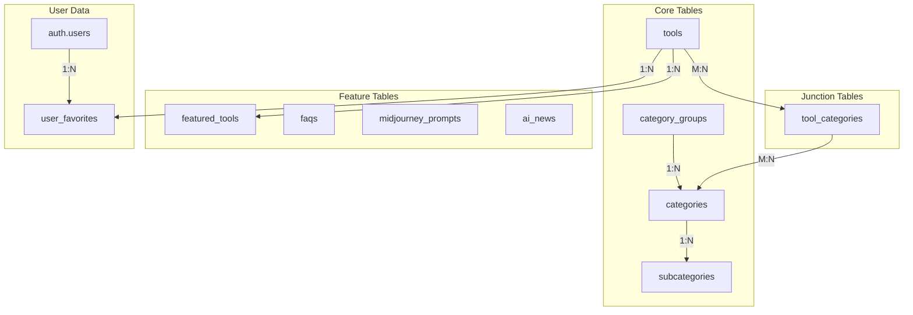

# Design Document

## Overview

This design document describes the architecture and implementation details for the optimized database schema for the AI Tools Book directory application. The schema consolidates 17 tables into 10 tables while maintaining full functionality through strategic merging and deferral to external services.

The design leverages PostgreSQL features including:
- Row Level Security (RLS) for access control
- Generated columns for full-text search
- GIN indexes for array and text search optimization
- CHECK constraints for data validation
- Cascade deletes for referential integrity

## Architecture

The database leverages Supabase's built-in connection pooler (PgBouncer) for efficient connection management under load, ensuring optimal resource utilization without additional configuration.



## Components and Interfaces

### Database Tables

#### 1. tools (Enhanced)

Primary table storing AI tool information with merged submission workflow.

```sql
CREATE TABLE tools (
    -- Core identification
    id UUID PRIMARY KEY DEFAULT gen_random_uuid(),
    name TEXT NOT NULL,
    slug TEXT UNIQUE NOT NULL,
    description TEXT,
    short_description TEXT,
    image_url TEXT,
    website_url TEXT NOT NULL,
    
    -- Classification
    pricing TEXT DEFAULT 'Freemium' CHECK (pricing IN ('Free', 'Freemium', 'Paid', 'Free Trial', 'Contact for Pricing')),
    tags TEXT[] DEFAULT '{}',
    
    -- Engagement metrics
    saved_count INTEGER DEFAULT 0 CHECK (saved_count >= 0),
    review_count INTEGER DEFAULT 0 CHECK (review_count >= 0),
    review_score DECIMAL(2,1) DEFAULT 0 CHECK (review_score >= 0 AND review_score <= 5),
    
    -- Display flags
    verified BOOLEAN DEFAULT false,
    is_new BOOLEAN DEFAULT false,
    is_featured BOOLEAN DEFAULT false,
    
    -- Ranking data
    monthly_visits INTEGER,
    change_percentage DECIMAL(5,2),
    
    -- Extensibility
    metadata JSONB DEFAULT '{}',
    
    -- Timestamps
    created_at TIMESTAMPTZ DEFAULT NOW(),
    updated_at TIMESTAMPTZ DEFAULT NOW(),
    
    -- Submission workflow (merged from tool_submissions)
    status TEXT DEFAULT 'published' CHECK (status IN ('draft', 'pending', 'published', 'rejected')),
    submitter_email TEXT,
    submitter_name TEXT,
    reviewed_by UUID REFERENCES auth.users(id),
    reviewed_at TIMESTAMPTZ,
    rejection_reason TEXT,
    
    -- Full-text search (generated column)
    search_vector tsvector GENERATED ALWAYS AS (
        setweight(to_tsvector('english', coalesce(name, '')), 'A') ||
        setweight(to_tsvector('english', coalesce(short_description, '')), 'B') ||
        setweight(to_tsvector('english', coalesce(description, '')), 'C') ||
        setweight(to_tsvector('english', coalesce(array_to_string(tags, ' '), '')), 'D')
    ) STORED
);

-- Indexes
CREATE INDEX idx_tools_slug ON tools(slug);
CREATE INDEX idx_tools_pricing ON tools(pricing);
CREATE INDEX idx_tools_status ON tools(status);
CREATE INDEX idx_tools_is_featured ON tools(is_featured) WHERE is_featured = true;
CREATE INDEX idx_tools_created_at ON tools(created_at DESC);
CREATE INDEX idx_tools_search_vector ON tools USING GIN(search_vector);
CREATE INDEX idx_tools_tags ON tools USING GIN(tags);
```

#### 2. categories

```sql
CREATE TABLE categories (
    id UUID PRIMARY KEY DEFAULT gen_random_uuid(),
    name TEXT NOT NULL,
    slug TEXT UNIQUE NOT NULL,
    description TEXT,
    icon TEXT,
    tool_count INTEGER DEFAULT 0,
    display_order INTEGER DEFAULT 0,
    group_id UUID REFERENCES category_groups(id) ON DELETE SET NULL,
    metadata JSONB DEFAULT '{}',
    created_at TIMESTAMPTZ DEFAULT NOW(),
    updated_at TIMESTAMPTZ DEFAULT NOW()
);

CREATE INDEX idx_categories_slug ON categories(slug);
CREATE INDEX idx_categories_group_id ON categories(group_id);
CREATE INDEX idx_categories_display_order ON categories(display_order);
```

#### 3. category_groups

```sql
CREATE TABLE category_groups (
    id UUID PRIMARY KEY DEFAULT gen_random_uuid(),
    name TEXT NOT NULL UNIQUE,
    icon_name TEXT,
    display_order INTEGER DEFAULT 0,
    created_at TIMESTAMPTZ DEFAULT NOW(),
    updated_at TIMESTAMPTZ DEFAULT NOW()
);

CREATE INDEX idx_category_groups_display_order ON category_groups(display_order);
```

#### 4. subcategories

```sql
CREATE TABLE subcategories (
    id UUID PRIMARY KEY DEFAULT gen_random_uuid(),
    category_id UUID NOT NULL REFERENCES categories(id) ON DELETE CASCADE,
    name TEXT NOT NULL,
    slug TEXT UNIQUE NOT NULL,
    tool_count INTEGER DEFAULT 0,
    display_order INTEGER DEFAULT 0,
    created_at TIMESTAMPTZ DEFAULT NOW(),
    updated_at TIMESTAMPTZ DEFAULT NOW()
);

CREATE INDEX idx_subcategories_category_id ON subcategories(category_id);
CREATE INDEX idx_subcategories_slug ON subcategories(slug);
```

#### 5. tool_categories (Junction)

```sql
CREATE TABLE tool_categories (
    tool_id UUID NOT NULL REFERENCES tools(id) ON DELETE CASCADE,
    category_id UUID NOT NULL REFERENCES categories(id) ON DELETE CASCADE,
    created_at TIMESTAMPTZ DEFAULT NOW(),
    PRIMARY KEY (tool_id, category_id)
);

CREATE INDEX idx_tool_categories_tool ON tool_categories(tool_id);
CREATE INDEX idx_tool_categories_category ON tool_categories(category_id);
```

#### 6. featured_tools (Enhanced)

```sql
CREATE TABLE featured_tools (
    id UUID PRIMARY KEY DEFAULT gen_random_uuid(),
    tool_id UUID NOT NULL REFERENCES tools(id) ON DELETE CASCADE,
    display_order INTEGER DEFAULT 0,
    placement_type TEXT DEFAULT 'homepage' CHECK (placement_type IN ('homepage', 'category', 'search')),
    is_sponsored BOOLEAN DEFAULT false,
    sponsor_name TEXT,
    campaign_id TEXT,
    start_date TIMESTAMPTZ,
    end_date TIMESTAMPTZ,
    impression_count INTEGER DEFAULT 0,
    click_count INTEGER DEFAULT 0,
    created_at TIMESTAMPTZ DEFAULT NOW()
);

CREATE INDEX idx_featured_tools_placement ON featured_tools(placement_type, display_order);
CREATE INDEX idx_featured_tools_active ON featured_tools(start_date, end_date) WHERE is_sponsored = true;
```

#### 7. faqs (Enhanced)

```sql
CREATE TABLE faqs (
    id UUID PRIMARY KEY DEFAULT gen_random_uuid(),
    question TEXT NOT NULL,
    answer TEXT NOT NULL,
    display_order INTEGER DEFAULT 0,
    category TEXT DEFAULT 'general',
    created_at TIMESTAMPTZ DEFAULT NOW()
);

CREATE INDEX idx_faqs_category_order ON faqs(category, display_order);
```

#### 8. user_favorites (Enhanced)

```sql
CREATE TABLE user_favorites (
    id UUID PRIMARY KEY DEFAULT gen_random_uuid(),
    user_email TEXT NOT NULL,
    tool_id TEXT NOT NULL,
    tool_name TEXT,
    category_id TEXT,
    is_shortcut BOOLEAN DEFAULT false,
    display_order INTEGER DEFAULT 0,
    custom_icon_color TEXT,
    created_at TIMESTAMPTZ DEFAULT NOW(),
    CONSTRAINT unique_user_tool UNIQUE(user_email, tool_id)
);

CREATE INDEX idx_user_favorites_user_email ON user_favorites(user_email);
CREATE INDEX idx_user_favorites_tool_id ON user_favorites(tool_id);
CREATE INDEX idx_user_favorites_shortcuts ON user_favorites(user_email, is_shortcut) WHERE is_shortcut = true;
```

#### 9. midjourney_prompts (New)

```sql
CREATE TABLE midjourney_prompts (
    id UUID PRIMARY KEY DEFAULT gen_random_uuid(),
    title TEXT NOT NULL,
    slug TEXT UNIQUE NOT NULL,
    sref_code TEXT,
    prompt_text TEXT,
    image_url TEXT,
    type TEXT NOT NULL CHECK (type IN ('sref', 'prompt')),
    tags TEXT[] DEFAULT '{}',
    view_count INTEGER DEFAULT 0,
    copy_count INTEGER DEFAULT 0,
    created_at TIMESTAMPTZ DEFAULT NOW(),
    updated_at TIMESTAMPTZ DEFAULT NOW()
);

CREATE INDEX idx_midjourney_prompts_slug ON midjourney_prompts(slug);
CREATE INDEX idx_midjourney_prompts_type ON midjourney_prompts(type);
CREATE INDEX idx_midjourney_prompts_tags ON midjourney_prompts USING GIN(tags);
CREATE INDEX idx_midjourney_prompts_view_count ON midjourney_prompts(view_count DESC);
CREATE INDEX idx_midjourney_prompts_copy_count ON midjourney_prompts(copy_count DESC);
CREATE INDEX idx_midjourney_prompts_created_at ON midjourney_prompts(created_at DESC);
```

#### 10. ai_news (New)

```sql
CREATE TABLE ai_news (
    id UUID PRIMARY KEY DEFAULT gen_random_uuid(),
    title TEXT NOT NULL,
    slug TEXT UNIQUE NOT NULL,
    summary TEXT,
    content TEXT,
    author_name TEXT,
    author_avatar TEXT,
    source_name TEXT,
    source_url TEXT,
    category TEXT,
    tags TEXT[] DEFAULT '{}',
    view_count INTEGER DEFAULT 0,
    like_count INTEGER DEFAULT 0,
    priority_score INTEGER DEFAULT 0,
    is_published BOOLEAN DEFAULT false,
    published_at TIMESTAMPTZ,
    created_at TIMESTAMPTZ DEFAULT NOW(),
    updated_at TIMESTAMPTZ DEFAULT NOW()
);

CREATE INDEX idx_ai_news_slug ON ai_news(slug);
CREATE INDEX idx_ai_news_category ON ai_news(category);
CREATE INDEX idx_ai_news_published ON ai_news(is_published, published_at DESC);
CREATE INDEX idx_ai_news_priority ON ai_news(priority_score DESC, published_at DESC);
CREATE INDEX idx_ai_news_tags ON ai_news USING GIN(tags);
```

### RLS Policies

#### Admin Function

```sql
CREATE OR REPLACE FUNCTION public.is_admin()
RETURNS BOOLEAN AS $$
BEGIN
    RETURN (
        SELECT COALESCE((raw_user_meta_data->>'role') = 'admin', false)
        FROM auth.users
        WHERE id = auth.uid()
    );
END;
$$ LANGUAGE plpgsql SECURITY DEFINER STABLE
SET search_path = public;
```

#### Public Read Access

```sql
-- Enable RLS on all tables
ALTER TABLE tools ENABLE ROW LEVEL SECURITY;
ALTER TABLE categories ENABLE ROW LEVEL SECURITY;
ALTER TABLE category_groups ENABLE ROW LEVEL SECURITY;
ALTER TABLE subcategories ENABLE ROW LEVEL SECURITY;
ALTER TABLE tool_categories ENABLE ROW LEVEL SECURITY;
ALTER TABLE featured_tools ENABLE ROW LEVEL SECURITY;
ALTER TABLE faqs ENABLE ROW LEVEL SECURITY;
ALTER TABLE midjourney_prompts ENABLE ROW LEVEL SECURITY;
ALTER TABLE ai_news ENABLE ROW LEVEL SECURITY;
ALTER TABLE user_favorites ENABLE ROW LEVEL SECURITY;

-- Public read policies
CREATE POLICY "Public read access" ON tools FOR SELECT USING (true);
CREATE POLICY "Public read access" ON categories FOR SELECT USING (true);
CREATE POLICY "Public read access" ON category_groups FOR SELECT USING (true);
CREATE POLICY "Public read access" ON subcategories FOR SELECT USING (true);
CREATE POLICY "Public read access" ON tool_categories FOR SELECT USING (true);
CREATE POLICY "Public read access" ON featured_tools FOR SELECT USING (true);
CREATE POLICY "Public read access" ON faqs FOR SELECT USING (true);
CREATE POLICY "Public read access" ON midjourney_prompts FOR SELECT USING (true);
CREATE POLICY "Public read access" ON ai_news FOR SELECT USING (is_published = true);
```

#### User Favorites RLS

```sql
CREATE POLICY "Users can view own favorites" ON user_favorites 
    FOR SELECT USING (auth.jwt() ->> 'email' = user_email);
CREATE POLICY "Users can insert own favorites" ON user_favorites 
    FOR INSERT WITH CHECK (auth.jwt() ->> 'email' = user_email);
CREATE POLICY "Users can update own favorites" ON user_favorites
    FOR UPDATE USING (auth.jwt() ->> 'email' = user_email);
CREATE POLICY "Users can delete own favorites" ON user_favorites 
    FOR DELETE USING (auth.jwt() ->> 'email' = user_email);
```

#### Admin Write Access

```sql
-- Apply to all public tables
CREATE POLICY "Admins can insert" ON tools FOR INSERT WITH CHECK (public.is_admin() OR status = 'pending');
CREATE POLICY "Admins can update" ON tools FOR UPDATE USING (public.is_admin());
CREATE POLICY "Admins can delete" ON tools FOR DELETE USING (public.is_admin());

-- Similar policies for other tables...
```

### Triggers

#### Updated At Trigger

```sql
CREATE OR REPLACE FUNCTION update_updated_at_column()
RETURNS TRIGGER AS $$
BEGIN
    NEW.updated_at = NOW();
    RETURN NEW;
END;
$$ LANGUAGE plpgsql;

-- Apply to tables with updated_at column
CREATE TRIGGER update_tools_updated_at BEFORE UPDATE ON tools
    FOR EACH ROW EXECUTE FUNCTION update_updated_at_column();
CREATE TRIGGER update_categories_updated_at BEFORE UPDATE ON categories
    FOR EACH ROW EXECUTE FUNCTION update_updated_at_column();
CREATE TRIGGER update_category_groups_updated_at BEFORE UPDATE ON category_groups
    FOR EACH ROW EXECUTE FUNCTION update_updated_at_column();
CREATE TRIGGER update_subcategories_updated_at BEFORE UPDATE ON subcategories
    FOR EACH ROW EXECUTE FUNCTION update_updated_at_column();
CREATE TRIGGER update_midjourney_prompts_updated_at BEFORE UPDATE ON midjourney_prompts
    FOR EACH ROW EXECUTE FUNCTION update_updated_at_column();
CREATE TRIGGER update_ai_news_updated_at BEFORE UPDATE ON ai_news
    FOR EACH ROW EXECUTE FUNCTION update_updated_at_column();
```

#### Shortcut Limit Trigger

Enforces the maximum 20 shortcuts per user constraint (Requirement 8.8).

```sql
CREATE OR REPLACE FUNCTION enforce_shortcut_limit()
RETURNS TRIGGER AS $
DECLARE
    shortcut_count INTEGER;
BEGIN
    IF NEW.is_shortcut = true THEN
        SELECT COUNT(*) INTO shortcut_count
        FROM user_favorites
        WHERE user_email = NEW.user_email
          AND is_shortcut = true
          AND id != COALESCE(NEW.id, '00000000-0000-0000-0000-000000000000'::uuid);
        
        IF shortcut_count >= 20 THEN
            RAISE EXCEPTION 'Maximum of 20 shortcuts allowed per user';
        END IF;
    END IF;
    RETURN NEW;
END;
$ LANGUAGE plpgsql;

CREATE TRIGGER enforce_user_shortcut_limit
    BEFORE INSERT OR UPDATE ON user_favorites
    FOR EACH ROW EXECUTE FUNCTION enforce_shortcut_limit();
```

## Data Models

### TypeScript Interfaces

```typescript
// Tool model
interface Tool {
    id: string;
    name: string;
    slug: string;
    description?: string;
    short_description?: string;
    image_url?: string;
    website_url: string;
    pricing: 'Free' | 'Freemium' | 'Paid' | 'Free Trial' | 'Contact for Pricing';
    tags: string[];
    saved_count: number;
    review_count: number;
    review_score: number;
    verified: boolean;
    is_new: boolean;
    is_featured: boolean;
    monthly_visits?: number;
    change_percentage?: number;
    metadata: Record<string, unknown>;
    status: 'draft' | 'pending' | 'published' | 'rejected';
    submitter_email?: string;
    submitter_name?: string;
    reviewed_by?: string;
    reviewed_at?: string;
    rejection_reason?: string;
    created_at: string;
    updated_at: string;
}

// Category model
interface Category {
    id: string;
    name: string;
    slug: string;
    description?: string;
    icon?: string;
    tool_count: number;
    display_order: number;
    group_id?: string;
    metadata: Record<string, unknown>;
    created_at: string;
    updated_at: string;
}

// User Favorite model
interface UserFavorite {
    id: string;
    user_email: string;
    tool_id: string;
    tool_name?: string;
    category_id?: string;
    is_shortcut: boolean;
    display_order: number;
    custom_icon_color?: string;
    created_at: string;
}
```

## Correctness Properties

*A property is a characteristic or behavior that should hold true across all valid executions of a system—essentially, a formal statement about what the system should do. Properties serve as the bridge between human-readable specifications and machine-verifiable correctness guarantees.*

Based on the prework analysis, the following consolidated properties will be tested:

### Property 1: Schema Completeness

*For any* table in the schema, all required columns SHALL exist with correct data types, constraints, and default values as specified in the requirements.

**Validates: Requirements 1.1, 1.3-1.5, 1.7, 2.1, 3.1, 4.1, 6.1, 6.3-6.5, 7.1-7.2, 8.1, 8.3-8.5, 9.1, 9.3-9.4, 10.1-10.6**

### Property 2: Index Completeness

*For any* table in the schema, all required indexes (B-tree and GIN) SHALL exist on the specified columns.

**Validates: Requirements 1.10-1.11, 2.3, 3.2, 4.3, 5.4, 6.6, 7.3, 8.6, 9.5-9.6, 10.7-10.8**

### Property 3: CHECK Constraint Enforcement

*For any* column with a CHECK constraint, inserting or updating with invalid values SHALL be rejected, and valid values SHALL be accepted.

**Validates: Requirements 1.2, 1.6, 6.2, 9.2**

### Property 4: Cascade Delete Behavior

*For any* parent record with dependent children via ON DELETE CASCADE, deleting the parent SHALL automatically delete all dependent children.

**Validates: Requirements 4.2, 5.2, 5.3**

### Property 5: Unique Constraint Enforcement

*For any* column or column combination with a UNIQUE constraint, inserting duplicate values SHALL be rejected.

**Validates: Requirements 5.1, 8.2**

### Property 6: RLS Policy Enforcement

*For any* table with RLS enabled, access control policies SHALL correctly restrict operations based on user authentication and role.

**Validates: Requirements 11.1-11.5, 11.7**

### Property 7: Trigger Behavior

*For any* table with an updated_at trigger, updating a row SHALL automatically set updated_at to the current timestamp.

**Validates: Requirements 12.4**

### Property 8: Full-Text Search Generation

*For any* tool record, the search_vector column SHALL be automatically generated with correct weighted terms from name, short_description, description, and tags.

**Validates: Requirements 1.9, 13.2, 13.5**

### Property 9: Search Relevance Ordering

*For any* full-text search query, results SHALL be ordered by relevance score using ts_rank().

**Validates: Requirements 13.4**

### Property 10: Featured Tools Date Filtering

*For any* query for active featured tools, only records where start_date <= NOW() AND end_date >= NOW() SHALL be returned.

**Validates: Requirements 6.7**

### Property 11: News Publication Filtering

*For any* public query to ai_news, only records where is_published = true SHALL be visible.

**Validates: Requirements 10.9, 11.3**

### Property 12: Shortcut Limit Enforcement

*For any* user, attempting to create more than 20 shortcuts (is_shortcut = true) SHALL be rejected by the database trigger.

**Validates: Requirements 8.8**

## Error Handling

### Database Errors

| Error Type | Handling Strategy |
|------------|-------------------|
| Unique constraint violation | Return 409 Conflict with field name |
| CHECK constraint violation | Return 400 Bad Request with constraint details |
| Foreign key violation | Return 400 Bad Request with relationship info |
| RLS policy violation | Return 403 Forbidden |
| Connection timeout | Retry with exponential backoff |

### Application-Level Validation

- Validate required fields before database insert
- Sanitize user input to prevent SQL injection (handled by Supabase client)
- Validate pricing enum values before insert
- Validate status transitions (e.g., draft → pending → published)

## Testing Strategy

### Property-Based Testing

Use **fast-check** library for TypeScript property-based testing with minimum 100 iterations per property.

```typescript
import fc from 'fast-check';

// Example: CHECK constraint enforcement
fc.assert(
    fc.property(
        fc.string(), // arbitrary pricing value
        async (pricing) => {
            const validPricing = ['Free', 'Freemium', 'Paid', 'Free Trial', 'Contact for Pricing'];
            const result = await insertTool({ pricing });
            if (validPricing.includes(pricing)) {
                expect(result.error).toBeNull();
            } else {
                expect(result.error).toBeDefined();
            }
        }
    ),
    { numRuns: 100 }
);
```

### Unit Tests

- Test individual repository methods
- Test mapper functions for data transformation
- Test validation functions
- Test error handling paths

### Integration Tests

- Test RLS policies with different user contexts
- Test cascade delete behavior
- Test trigger execution
- Test full-text search functionality

### Test Configuration

- Use Vitest as test runner
- Use Supabase local development for database tests
- Tag tests with property references: `// Feature: database-schema-redesign, Property 3: CHECK Constraint Enforcement`
