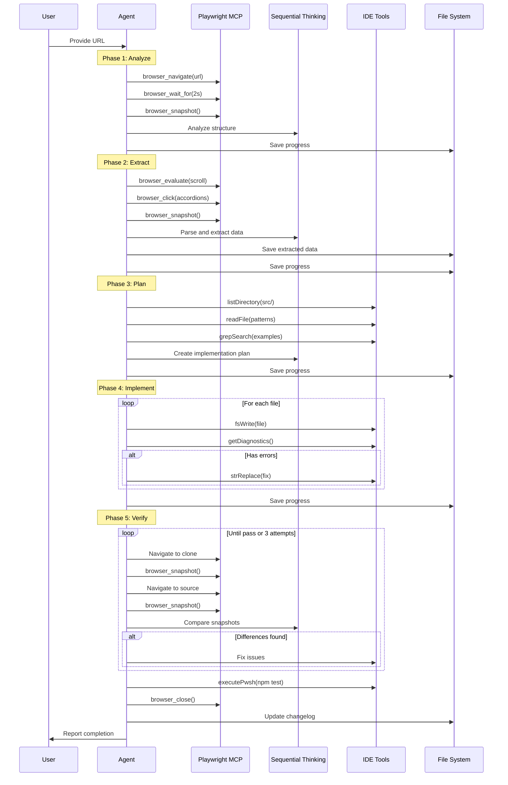
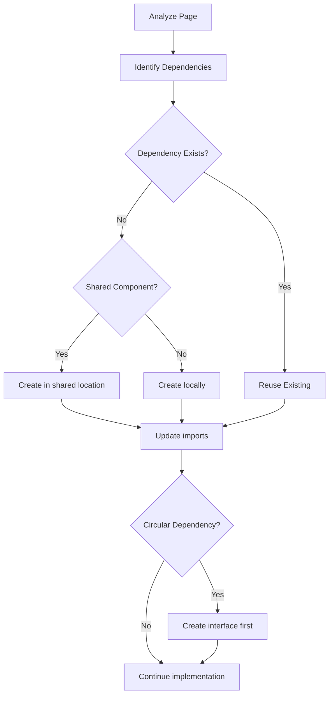

# Design Document: Page Cloning Agent

## Overview

The Page Cloning Agent is an autonomous workflow system that enables exact replication of pages from a hosted source website (e.g., toolify.ai) into this Next.js project. When provided with a URL, the agent orchestrates multiple MCP servers (Playwright, fetch, sequential thinking) to analyze, extract, implement, and verify page clones with zero data loss and visual parity.

The agent operates autonomously, self-monitoring its progress, auto-correcting errors, and iterating until the clone matches the source exactly.

## Architecture

```mermaid
graph TB
    subgraph "Input"
        URL[Source URL]
    end
    
    subgraph "MCP Servers"
        PW[Playwright MCP<br/>browser_navigate<br/>browser_snapshot<br/>browser_click<br/>browser_evaluate]
        FETCH[Fetch MCP<br/>API calls<br/>Documentation]
        SEQ[Sequential Thinking MCP<br/>Complex decisions<br/>Problem solving]
    end
    
    subgraph "Agent Phases"
        P1[1. Analyze<br/>DOM structure<br/>Sections<br/>Interactions]
        P2[2. Extract<br/>Text, Images<br/>Links, Metadata<br/>All data]
        P3[3. Plan<br/>Components<br/>Routes<br/>Data models]
        P4[4. Implement<br/>Components<br/>Pages<br/>Services]
        P5[5. Verify<br/>Visual parity<br/>Data completeness<br/>Link integrity]
    end
    
    subgraph "IDE Tools"
        FS[fsWrite / fsAppend<br/>File creation]
        SR[strReplace<br/>File modification]
        RD[readFile / listDirectory<br/>Project analysis]
        GS[grepSearch<br/>Pattern finding]
        DG[getDiagnostics<br/>Error checking]
        EX[executePwsh<br/>Test running]
    end
    
    subgraph "Output"
        PAGES[Page Components<br/>src/app/(site)/...]
        COMP[Feature Components<br/>src/components/features/...]
        DATA[JSON Data Files<br/>src/data/...]
        SVC[Service Layer<br/>src/lib/services/...]
        TYPES[TypeScript Types<br/>src/lib/types/...]
        TESTS[Test Files<br/>*.test.ts]
    end
    
    subgraph "Progress Tracking"
        PROG[Progress File<br/>.kiro/specs/page-cloning-agent/progress/]
        LOG[Changelog<br/>CHANGELOG.md]
    end
    
    URL --> P1
    P1 --> P2 --> P3 --> P4 --> P5
    P5 -->|Issues found| P4
    P5 -->|All pass| LOG
    
    PW --> P1
    PW --> P2
    PW --> P5
    FETCH --> P2
    SEQ --> P1
    SEQ --> P3
    SEQ --> P5
    
    P3 --> FS
    P4 --> FS
    P4 --> SR
    P3 --> RD
    P3 --> GS
    P4 --> DG
    P5 --> EX
    
    P4 --> PAGES
    P4 --> COMP
    P2 --> DATA
    P4 --> SVC
    P3 --> TYPES
    P4 --> TESTS
    
    P1 --> PROG
    P2 --> PROG
    P3 --> PROG
    P4 --> PROG
    P5 --> PROG
```

## Components and Interfaces

### 1. Phase Orchestrator

The agent executes 5 phases in sequence, with the ability to loop back for corrections.

```typescript
interface PhaseResult {
  phase: 'analyze' | 'extract' | 'plan' | 'implement' | 'verify';
  status: 'success' | 'failed' | 'needs_retry';
  data?: unknown;
  errors?: string[];
  timestamp: string;
}

interface CloneProgress {
  sourceUrl: string;
  pageSlug: string;
  startedAt: string;
  phases: PhaseResult[];
  currentPhase: string;
  completedAt?: string;
  filesCreated: string[];
  filesModified: string[];
}
```


### 2. Phase 1: Page Analysis

Uses Playwright MCP to load and analyze the source page.

**MCP Operations:**
```typescript
// 1. Navigate to source URL
mcp_playwright_browser_navigate({ url: sourceUrl });

// 2. Wait for content to load (network idle)
mcp_playwright_browser_wait_for({ time: 2 });

// 3. Capture accessibility snapshot
const snapshot = mcp_playwright_browser_snapshot({});

// 4. Analyze page structure using sequential thinking
mcp_sequentialthinking_sequentialthinking({
  thought: "Analyzing page structure from snapshot...",
  thoughtNumber: 1,
  totalThoughts: 5,
  nextThoughtNeeded: true
});
```

**Output: PageAnalysis**
```typescript
interface PageAnalysis {
  url: string;
  title: string;
  sections: Section[];
  navigation: NavigationPattern[];
  interactiveElements: InteractiveElement[];
  responsiveBreakpoints: string[];
  dependencies: string[]; // Links to other pages
}

interface Section {
  id: string;
  type: 'header' | 'sidebar' | 'main' | 'footer' | 'panel' | 'modal';
  selector: string;
  children: Section[];
}

interface InteractiveElement {
  type: 'button' | 'link' | 'accordion' | 'dropdown' | 'tab' | 'form';
  selector: string;
  action: string;
}
```

### 3. Phase 2: Data Extraction

Extracts all content from the source page with 100% completeness.

**MCP Operations:**
```typescript
// 1. Scroll to load all lazy content
mcp_playwright_browser_evaluate({
  function: `async () => {
    await new Promise(resolve => {
      let totalHeight = 0;
      const distance = 500;
      const timer = setInterval(() => {
        window.scrollBy(0, distance);
        totalHeight += distance;
        if (totalHeight >= document.body.scrollHeight) {
          clearInterval(timer);
          resolve();
        }
      }, 100);
    });
  }`
});

// 2. Expand all accordions/tabs
mcp_playwright_browser_click({ element: "accordion", ref: "..." });

// 3. Capture full snapshot after all content loaded
const fullSnapshot = mcp_playwright_browser_snapshot({});

// 4. Extract structured data
// Parse snapshot to extract text, links, images, metadata
```

**Output: ExtractedData**
```typescript
interface ExtractedData {
  metadata: PageMetadata;
  textContent: TextBlock[];
  images: ImageData[];
  links: LinkData[];
  lists: ListData[];
  forms: FormData[];
  structuredData: object; // JSON-LD
  extractedAt: string;
  itemCounts: {
    text: number;
    images: number;
    links: number;
    listItems: number;
  };
}

interface PageMetadata {
  title: string;
  description: string;
  ogTitle: string;
  ogDescription: string;
  ogImage: string;
  canonical: string;
}

interface TextBlock {
  id: string;
  content: string;
  tag: 'h1' | 'h2' | 'h3' | 'p' | 'span' | 'li';
  order: number;
}

interface ImageData {
  src: string;
  alt: string;
  width?: number;
  height?: number;
}

interface LinkData {
  href: string;
  text: string;
  type: 'internal' | 'external' | 'anchor';
  attributes: Record<string, string>;
}
```

### 4. Phase 3: Implementation Planning

Analyzes project patterns and creates implementation plan.

**IDE Tool Operations:**
```typescript
// 1. Analyze existing project structure
listDirectory({ path: "src/app/(site)", depth: 2 });
listDirectory({ path: "src/components/features", depth: 2 });
listDirectory({ path: "src/data", depth: 2 });

// 2. Find similar implementations
grepSearch({ query: "export default async function", includePattern: "**/*page.tsx" });

// 3. Read existing patterns
readFile({ path: "src/lib/services/free-ai-tools.service.ts" });
readFile({ path: "src/lib/types/free-ai-tools.ts" });

// 4. Plan using sequential thinking
mcp_sequentialthinking_sequentialthinking({
  thought: "Planning implementation based on extracted data and project patterns...",
  thoughtNumber: 1,
  totalThoughts: 10,
  nextThoughtNeeded: true
});
```

**Output: ImplementationPlan**
```typescript
interface ImplementationPlan {
  pageRoute: string;
  components: ComponentPlan[];
  dataFiles: DataFilePlan[];
  serviceUpdates: ServiceUpdate[];
  typeDefinitions: TypeDefinition[];
  configUpdates: ConfigUpdate[];
}

interface ComponentPlan {
  name: string;
  path: string;
  props: string[];
  reusesExisting: string | null;
}

interface DataFilePlan {
  path: string;
  schema: object;
  sourceMapping: Record<string, string>;
}
```


### 5. Phase 4: Implementation

Creates all files using IDE tools.

**IDE Tool Operations:**
```typescript
// 1. Create TypeScript interfaces
fsWrite({ 
  path: "src/lib/types/{feature}.ts",
  text: typeDefinitions 
});

// 2. Create data files
fsWrite({
  path: "src/data/{feature}/{slug}.json",
  text: JSON.stringify(extractedData, null, 2)
});

// 3. Create service layer
fsWrite({
  path: "src/lib/services/{feature}.service.ts",
  text: serviceCode
});

// 4. Create components
fsWrite({
  path: "src/components/features/{feature}/{Component}.tsx",
  text: componentCode
});

// 5. Create page
fsWrite({
  path: "src/app/(site)/{route}/page.tsx",
  text: pageCode
});

// 6. Create loading/error states
fsWrite({
  path: "src/app/(site)/{route}/loading.tsx",
  text: loadingCode
});
fsWrite({
  path: "src/app/(site)/{route}/error.tsx",
  text: errorCode
});

// 7. Check for errors after each file
getDiagnostics({ paths: [createdFilePath] });

// 8. Fix any TypeScript/lint errors
strReplace({ path: filePath, oldStr: errorCode, newStr: fixedCode });

// 9. Update next.config.js for remote images
strReplace({
  path: "next.config.js",
  oldStr: "remotePatterns: [",
  newStr: `remotePatterns: [\n    { hostname: '${newDomain}' },`
});

// 10. Create tests
fsWrite({
  path: "src/app/(site)/{route}/page.test.ts",
  text: testCode
});
```

### 6. Phase 5: Verification

Compares clone against source and iterates until perfect.

**Verification Loop:**
```typescript
// 1. Start dev server (if not running)
controlPwshProcess({ action: "start", command: "npm run dev" });

// 2. Navigate to clone page
mcp_playwright_browser_navigate({ url: "http://localhost:3000/{route}" });

// 3. Capture clone snapshot
const cloneSnapshot = mcp_playwright_browser_snapshot({});

// 4. Navigate to source page
mcp_playwright_browser_navigate({ url: sourceUrl });

// 5. Capture source snapshot
const sourceSnapshot = mcp_playwright_browser_snapshot({});

// 6. Compare using sequential thinking
mcp_sequentialthinking_sequentialthinking({
  thought: "Comparing source and clone snapshots for differences...",
  thoughtNumber: 1,
  totalThoughts: 5,
  nextThoughtNeeded: true
});

// 7. If differences found, fix and re-verify
// Loop up to 3 times before asking user

// 8. Run tests
executePwsh({ command: "npm run test" });

// 9. Check for console errors
mcp_playwright_browser_console_messages({ level: "error" });
```

**QA Checklist:**
```typescript
interface QAResult {
  textContentMatch: boolean;
  imagesDisplayed: boolean;
  linksWorking: boolean;
  responsiveDesign: {
    mobile: boolean;
    tablet: boolean;
    desktop: boolean;
  };
  keyboardNavigation: boolean;
  noConsoleErrors: boolean;
  typescriptClean: boolean;
  testsPass: boolean;
  deviations: string[];
}
```

## Data Models

### Progress Tracking Schema

**Path:** `.kiro/specs/page-cloning-agent/progress/{page-slug}.json`

```typescript
interface ProgressFile {
  sourceUrl: string;
  pageSlug: string;
  startedAt: string;
  lastUpdatedAt: string;
  status: 'in_progress' | 'completed' | 'failed' | 'paused';
  phases: {
    analyze: PhaseStatus;
    extract: PhaseStatus;
    plan: PhaseStatus;
    implement: PhaseStatus;
    verify: PhaseStatus;
  };
  extractedData?: ExtractedData;
  implementationPlan?: ImplementationPlan;
  filesCreated: string[];
  filesModified: string[];
  errors: ErrorLog[];
  verificationAttempts: number;
  completedAt?: string;
}

interface PhaseStatus {
  status: 'pending' | 'in_progress' | 'completed' | 'failed';
  startedAt?: string;
  completedAt?: string;
  error?: string;
}

interface ErrorLog {
  phase: string;
  error: string;
  timestamp: string;
  resolution?: string;
}
```

### Extracted Data Storage

**Path:** `src/data/{feature}/{slug}.json`

```json
{
  "_metadata": {
    "sourceUrl": "https://example.com/page",
    "extractedAt": "2025-12-15T10:00:00Z",
    "itemCounts": {
      "categories": 22,
      "tools": 150,
      "images": 45
    }
  },
  "data": {
    // Actual extracted data
  }
}
```


## Correctness Properties

*A property is a characteristic or behavior that should hold true across all valid executions of a system-essentially, a formal statement about what the system should do. Properties serve as the bridge between human-readable specifications and machine-verifiable correctness guarantees.*

Based on the prework analysis, the following correctness properties have been identified:

### Property 1: Data Extraction Completeness
*For any* source page with N visible list items, the extracted data SHALL contain exactly N items in the same order.
**Validates: Requirements 2.5, 5.7, 12.1**

### Property 2: JSON Serialization Round-Trip
*For any* valid ExtractedData object, serializing to JSON with 2-space indentation and parsing back SHALL produce an equivalent object.
**Validates: Requirements 5.2**

### Property 3: TypeScript Interface Conformance
*For any* stored JSON data file, the data SHALL successfully validate against its corresponding Zod schema without errors.
**Validates: Requirements 5.3, 5.4, 12.6**

### Property 4: External Link Preservation
*For any* external link extracted from the source, the implemented link SHALL contain the exact same URL including all query parameters.
**Validates: Requirements 7.2**

### Property 5: External Link Security Attributes
*For any* external link in the implemented clone, the link element SHALL have target="_blank" and rel="noopener noreferrer" attributes.
**Validates: Requirements 7.3, 25.2**

### Property 6: Rate Limiting Compliance
*For any* sequence of page navigations during scraping, the time between consecutive navigations SHALL be at least 2000 milliseconds.
**Validates: Requirements 18.1**

### Property 7: Exponential Backoff on 429
*For any* HTTP 429 response, the retry delay SHALL follow exponential backoff starting at 5 seconds, doubling each retry, with maximum 60 seconds.
**Validates: Requirements 18.3**

### Property 8: Image Domain Configuration
*For any* external image domain used in the clone, that domain SHALL exist in next.config.js images.remotePatterns array.
**Validates: Requirements 20.3**

### Property 9: Progress File Updates
*For any* completed phase, the progress file SHALL contain a status entry with 'completed' status and a valid timestamp.
**Validates: Requirements 21.2**

### Property 10: XSS Sanitization
*For any* user-generated content containing script tags or event handlers, the sanitized output SHALL not contain executable JavaScript.
**Validates: Requirements 25.1**

### Property 11: Item Count Verification
*For any* data extraction, the logged item count SHALL equal the actual number of items in the stored JSON file.
**Validates: Requirements 2.9, 12.4**

### Property 12: Data Ordering Preservation
*For any* list of items extracted from the source, the stored JSON SHALL maintain the exact same ordering as the source page.
**Validates: Requirements 5.7**

## Error Handling

### Scraping Errors

```typescript
class ScrapingError extends Error {
  constructor(
    message: string,
    public code: 'TIMEOUT' | 'BLOCKED' | 'NOT_FOUND' | 'PARSE_ERROR',
    public retryable: boolean,
    public sourceUrl: string
  ) {
    super(message);
    this.name = 'ScrapingError';
  }
}

// Rate limit handling
async function handleRateLimit(attempt: number): Promise<void> {
  const delay = Math.min(5000 * Math.pow(2, attempt), 60000);
  await new Promise(resolve => setTimeout(resolve, delay));
}

// CAPTCHA detection
function detectCaptcha(snapshot: string): boolean {
  return snapshot.includes('captcha') || 
         snapshot.includes('robot') ||
         snapshot.includes('verify you are human');
}
```

### Implementation Errors

```typescript
// Auto-fix TypeScript errors
async function fixDiagnosticErrors(filePath: string): Promise<boolean> {
  const diagnostics = await getDiagnostics({ paths: [filePath] });
  
  for (const error of diagnostics) {
    // Use sequential thinking to analyze and fix
    const fix = await analyzeAndFix(error);
    if (fix) {
      await strReplace({ path: filePath, oldStr: fix.oldStr, newStr: fix.newStr });
    }
  }
  
  // Re-check
  const remaining = await getDiagnostics({ paths: [filePath] });
  return remaining.length === 0;
}
```

### Recovery from Interruption

```typescript
async function resumeClone(pageSlug: string): Promise<void> {
  const progressPath = `.kiro/specs/page-cloning-agent/progress/${pageSlug}.json`;
  const progress = await readProgressFile(progressPath);
  
  if (!progress) {
    throw new Error('No progress file found');
  }
  
  // Find last completed phase
  const phases = ['analyze', 'extract', 'plan', 'implement', 'verify'];
  let resumeFrom = 0;
  
  for (let i = 0; i < phases.length; i++) {
    if (progress.phases[phases[i]].status === 'completed') {
      resumeFrom = i + 1;
    }
  }
  
  // Resume from next phase using saved data
  if (resumeFrom < phases.length) {
    await executePhase(phases[resumeFrom], progress.extractedData);
  }
}
```

## Testing Strategy

### Property-Based Testing Library
**Library:** fast-check (TypeScript/JavaScript)

Configuration:
- Minimum 100 iterations per property test
- Seed logging for reproducibility

### Unit Tests
- Data extraction functions
- JSON serialization/deserialization
- URL parsing and validation
- Sanitization functions
- Progress file management

### Property-Based Tests

Each property test will be tagged with the format:
`**Feature: page-cloning-agent, Property {number}: {property_text}**`

```typescript
import * as fc from 'fast-check';
import { describe, it, expect } from 'vitest';

// **Feature: page-cloning-agent, Property 2: JSON Serialization Round-Trip**
// **Validates: Requirements 5.2**
describe('JSON Serialization Round-Trip', () => {
  it('should preserve ExtractedData through serialize/parse cycle', () => {
    fc.assert(
      fc.property(extractedDataArbitrary, (data) => {
        const serialized = JSON.stringify(data, null, 2);
        const parsed = JSON.parse(serialized);
        expect(parsed).toEqual(data);
      }),
      { numRuns: 100 }
    );
  });
});

// **Feature: page-cloning-agent, Property 5: External Link Security Attributes**
// **Validates: Requirements 7.3, 25.2**
describe('External Link Security', () => {
  it('should have security attributes on all external links', () => {
    fc.assert(
      fc.property(externalLinkArbitrary, (link) => {
        const rendered = renderExternalLink(link);
        expect(rendered).toContain('target="_blank"');
        expect(rendered).toContain('rel="noopener noreferrer"');
      }),
      { numRuns: 100 }
    );
  });
});

// **Feature: page-cloning-agent, Property 10: XSS Sanitization**
// **Validates: Requirements 25.1**
describe('XSS Sanitization', () => {
  it('should remove all executable JavaScript from content', () => {
    fc.assert(
      fc.property(maliciousContentArbitrary, (content) => {
        const sanitized = sanitizeContent(content);
        expect(sanitized).not.toMatch(/<script/i);
        expect(sanitized).not.toMatch(/on\w+=/i);
        expect(sanitized).not.toMatch(/javascript:/i);
      }),
      { numRuns: 100 }
    );
  });
});
```

### Integration Tests
- Full clone workflow with mock source
- Progress file persistence and recovery
- Error handling and retry logic

### E2E Tests (Playwright)
```typescript
import { test, expect } from '@playwright/test';

test('cloned page matches source structure', async ({ page }) => {
  // Navigate to clone
  await page.goto('http://localhost:3000/cloned-page');
  
  // Verify key elements exist
  await expect(page.locator('h1')).toBeVisible();
  await expect(page.locator('nav')).toBeVisible();
  
  // Verify no console errors
  const errors: string[] = [];
  page.on('console', msg => {
    if (msg.type() === 'error') errors.push(msg.text());
  });
  
  await page.waitForLoadState('networkidle');
  expect(errors).toHaveLength(0);
});
```


## MCP Server Usage Guide

### Playwright MCP Server

Used for browser automation to analyze and scrape source pages, and verify clones.

| Tool | Purpose | When to Use |
|------|---------|-------------|
| `browser_navigate` | Load a URL | Start of analysis, verification |
| `browser_snapshot` | Capture DOM structure | After page load, after scrolling |
| `browser_click` | Interact with elements | Expand accordions, click tabs |
| `browser_evaluate` | Run JavaScript | Scroll page, extract data |
| `browser_wait_for` | Wait for content | After navigation, after AJAX |
| `browser_console_messages` | Check for errors | During verification |
| `browser_close` | Clean up | After scraping complete |

### Fetch MCP Server

Used for API calls and fetching documentation.

| Tool | Purpose | When to Use |
|------|---------|-------------|
| `fetch` | GET request | Fetch API data, documentation |

### Sequential Thinking MCP Server

Used for complex decision-making and problem-solving.

| Tool | Purpose | When to Use |
|------|---------|-------------|
| `sequentialthinking` | Step-by-step reasoning | Analysis, planning, debugging |

## Workflow Execution Sequence



## File Structure

```
.kiro/specs/page-cloning-agent/
├── requirements.md          # This requirements document
├── design.md               # This design document
├── tasks.md                # Implementation tasks
├── CHANGELOG.md            # Log of all cloned pages
└── progress/               # Progress tracking files
    ├── {page-slug-1}.json
    └── {page-slug-2}.json

src/
├── app/(site)/
│   └── {cloned-route}/
│       ├── page.tsx        # Main page component
│       ├── loading.tsx     # Loading skeleton
│       ├── error.tsx       # Error boundary
│       └── page.test.ts    # Page tests
├── components/features/{feature}/
│   ├── {Component1}.tsx
│   ├── {Component2}.tsx
│   └── index.ts            # Barrel export
├── data/{feature}/
│   ├── {data-file}.json
│   └── metadata.json
├── lib/
│   ├── services/{feature}.service.ts
│   └── types/{feature}.ts
```

## Usage Instructions

When you need to clone a page, provide the URL and the agent will:

1. **Analyze** - Load the page with Playwright, capture DOM structure
2. **Extract** - Scroll to load all content, extract all data
3. **Plan** - Analyze project patterns, create implementation plan
4. **Implement** - Create all files, fix any errors
5. **Verify** - Compare clone to source, iterate until perfect

The agent will:
- Use sequential thinking for complex decisions
- Auto-fix TypeScript/lint errors
- Re-extract data if counts don't match
- Keep iterating until visual parity is achieved
- Only ask for help after 3 failed fix attempts
- Document everything in the changelog

## Dependency Resolution

The agent handles page dependencies to ensure shared components and data are created in the correct order.

**Validates: Requirement 22**

### Dependency Analysis

```typescript
interface PageDependency {
  type: 'component' | 'data' | 'route' | 'service';
  path: string;
  status: 'exists' | 'needs_creation' | 'stub';
  dependsOn: string[];
}

interface DependencyGraph {
  pageSlug: string;
  dependencies: PageDependency[];
  sharedComponents: string[];
  sharedData: string[];
  linkedPages: string[];
}
```

### Dependency Resolution Strategy



### Implementation Rules

1. **Shared Components**: When multiple pages need the same component, create it in `src/components/features/{feature}/` with barrel exports
2. **Shared Data**: When multiple pages reference the same data, create a single JSON file in `src/data/{feature}/`
3. **Stub Creation**: If a dependency cannot be fully implemented, create a stub with TODO comments
4. **Linked Pages**: Document unimplemented linked pages in the progress file for future work

```typescript
// Example: Checking for existing shared components
async function resolveDependencies(analysis: PageAnalysis): Promise<DependencyGraph> {
  const dependencies: PageDependency[] = [];
  
  // Check for existing components
  for (const component of analysis.requiredComponents) {
    const exists = await fileExists(`src/components/features/${component}.tsx`);
    dependencies.push({
      type: 'component',
      path: `src/components/features/${component}.tsx`,
      status: exists ? 'exists' : 'needs_creation',
      dependsOn: []
    });
  }
  
  // Check for linked pages
  const linkedPages = analysis.navigation
    .filter(nav => nav.type === 'internal')
    .map(nav => nav.href);
  
  return {
    pageSlug: analysis.pageSlug,
    dependencies,
    sharedComponents: [],
    sharedData: [],
    linkedPages
  };
}
```

## Performance Optimization

The agent implements performance best practices to ensure fast page loads.

**Validates: Requirement 24**

### Image Optimization

```typescript
// Always use Next.js Image component
import Image from 'next/image';

// Example implementation
<Image
  src={imageUrl}
  alt={altText}
  width={width}
  height={height}
  loading="lazy"  // Default lazy loading
  placeholder="blur"
  blurDataURL={placeholderUrl}
/>
```

### List Virtualization

For lists with more than 100 items, implement virtualization:

```typescript
// Use react-window for large lists
import { FixedSizeList } from 'react-window';

interface VirtualizedListProps {
  items: Item[];
  itemHeight: number;
}

function VirtualizedList({ items, itemHeight }: VirtualizedListProps) {
  if (items.length <= 100) {
    // Render normally for small lists
    return <NormalList items={items} />;
  }
  
  return (
    <FixedSizeList
      height={600}
      itemCount={items.length}
      itemSize={itemHeight}
      width="100%"
    >
      {({ index, style }) => (
        <div style={style}>
          <ListItem item={items[index]} />
        </div>
      )}
    </FixedSizeList>
  );
}
```

### Dynamic Imports

Heavy components not needed on initial load should use dynamic imports:

```typescript
import dynamic from 'next/dynamic';

// Lazy load heavy components
const HeavyChart = dynamic(() => import('./HeavyChart'), {
  loading: () => <ChartSkeleton />,
  ssr: false
});

const ModalDialog = dynamic(() => import('./ModalDialog'), {
  loading: () => null
});
```

### Data Splitting Strategy

Large JSON files should be split by category to reduce bundle size:

```
src/data/{feature}/
├── categories.json          # Category metadata only (~5KB)
├── categories/
│   ├── category-1.json      # Items for category 1
│   ├── category-2.json      # Items for category 2
│   └── ...
└── metadata.json            # Extraction metadata
```

### ISR Configuration

Pages should use Incremental Static Regeneration:

```typescript
// In page.tsx
export const revalidate = 3600; // Revalidate every hour

// Or for more dynamic content
export const revalidate = 60; // Revalidate every minute
```

### Performance Checklist

| Check | Implementation |
|-------|---------------|
| Images use Next.js Image | `<Image>` component with width/height |
| Large lists virtualized | react-window for 100+ items |
| Heavy components lazy loaded | `dynamic()` imports |
| Data files split | Separate JSON per category |
| ISR configured | `revalidate` export in page |
| No unnecessary re-renders | React.memo, useMemo, useCallback |

## SEO Implementation

The agent implements comprehensive SEO for all cloned pages.

**Validates: Requirement 8**

### Metadata Generation

```typescript
import { Metadata } from 'next';

export async function generateMetadata({ params }): Promise<Metadata> {
  const data = await getPageData(params.slug);
  
  return {
    title: data.metadata.title,
    description: data.metadata.description,
    openGraph: {
      title: data.metadata.ogTitle || data.metadata.title,
      description: data.metadata.ogDescription || data.metadata.description,
      images: [{ url: data.metadata.ogImage }],
      type: 'website',
    },
    twitter: {
      card: 'summary_large_image',
      title: data.metadata.ogTitle || data.metadata.title,
      description: data.metadata.ogDescription || data.metadata.description,
      images: [data.metadata.ogImage],
    },
    alternates: {
      canonical: `https://yourdomain.com/${params.slug}`,
    },
  };
}
```

### JSON-LD Structured Data

```typescript
// Component for structured data
function StructuredData({ data }: { data: object }) {
  return (
    <script
      type="application/ld+json"
      dangerouslySetInnerHTML={{ __html: JSON.stringify(data) }}
    />
  );
}

// Example usage in page
const structuredData = {
  '@context': 'https://schema.org',
  '@type': 'WebPage',
  name: pageData.title,
  description: pageData.description,
  url: canonicalUrl,
  // ... additional schema properties
};
```

### Sitemap Integration

After creating a new page, update the sitemap:

```typescript
// In src/app/sitemap.ts
export default async function sitemap(): Promise<MetadataRoute.Sitemap> {
  const pages = await getAllPages();
  
  return pages.map(page => ({
    url: `https://yourdomain.com${page.path}`,
    lastModified: page.updatedAt,
    changeFrequency: 'weekly',
    priority: page.priority || 0.8,
  }));
}
```

## Dynamic Content Handling

The agent handles various dynamic content patterns to ensure complete data extraction.

**Validates: Requirement 19**

### Infinite Scroll

```typescript
// Scroll to load all content
async function handleInfiniteScroll(): Promise<void> {
  let previousHeight = 0;
  let currentHeight = await getPageHeight();
  
  while (currentHeight > previousHeight) {
    previousHeight = currentHeight;
    
    // Scroll to bottom
    await mcp_playwright_browser_evaluate({
      function: `() => window.scrollTo(0, document.body.scrollHeight)`
    });
    
    // Wait for new content to load
    await mcp_playwright_browser_wait_for({ time: 1 });
    
    currentHeight = await getPageHeight();
  }
}
```

### Load More Buttons

```typescript
// Click all "Load More" buttons until exhausted
async function handleLoadMoreButtons(): Promise<void> {
  let loadMoreExists = true;
  
  while (loadMoreExists) {
    const snapshot = await mcp_playwright_browser_snapshot({});
    
    // Find load more button
    const loadMoreRef = findLoadMoreButton(snapshot);
    
    if (loadMoreRef) {
      await mcp_playwright_browser_click({
        element: 'Load More button',
        ref: loadMoreRef
      });
      
      // Wait for content to load
      await mcp_playwright_browser_wait_for({ time: 1 });
    } else {
      loadMoreExists = false;
    }
  }
}
```

### Tab and Accordion Expansion

```typescript
// Expand all tabs and accordions before extraction
async function expandAllSections(): Promise<void> {
  const snapshot = await mcp_playwright_browser_snapshot({});
  
  // Find all collapsed accordions
  const accordions = findCollapsedAccordions(snapshot);
  for (const accordion of accordions) {
    await mcp_playwright_browser_click({
      element: 'Accordion header',
      ref: accordion.ref
    });
    await mcp_playwright_browser_wait_for({ time: 0.3 });
  }
  
  // Find all tabs and click each
  const tabs = findAllTabs(snapshot);
  for (const tab of tabs) {
    await mcp_playwright_browser_click({
      element: 'Tab',
      ref: tab.ref
    });
    await mcp_playwright_browser_wait_for({ time: 0.3 });
    
    // Capture content from this tab
    const tabSnapshot = await mcp_playwright_browser_snapshot({});
    // Store tab content...
  }
}
```

### Pagination Handling

```typescript
// Navigate through all pages and aggregate data
async function handlePagination(): Promise<ExtractedData[]> {
  const allData: ExtractedData[] = [];
  let hasNextPage = true;
  let pageNum = 1;
  
  while (hasNextPage) {
    // Extract current page data
    const pageData = await extractCurrentPageData();
    allData.push(pageData);
    
    // Find next page button
    const snapshot = await mcp_playwright_browser_snapshot({});
    const nextButton = findNextPageButton(snapshot);
    
    if (nextButton && pageNum < 100) { // Safety limit
      await mcp_playwright_browser_click({
        element: 'Next page button',
        ref: nextButton.ref
      });
      await mcp_playwright_browser_wait_for({ time: 1 });
      pageNum++;
    } else {
      hasNextPage = false;
    }
  }
  
  return allData;
}
```

### AJAX Content Waiting

```typescript
// Wait for AJAX content to finish loading
async function waitForAjaxContent(): Promise<void> {
  // Wait for network to be idle (no requests for 500ms)
  await mcp_playwright_browser_evaluate({
    function: `async () => {
      await new Promise(resolve => {
        let timeout;
        const observer = new PerformanceObserver(() => {
          clearTimeout(timeout);
          timeout = setTimeout(resolve, 500);
        });
        observer.observe({ entryTypes: ['resource'] });
        timeout = setTimeout(resolve, 2000); // Max wait 2s
      });
    }`
  });
}
```

## Responsive Design

The agent will implement responsive layouts matching the source:

| Breakpoint | Width | Layout |
|------------|-------|--------|
| Mobile | < 768px | Single column, stacked |
| Tablet | 768px - 1024px | Two columns |
| Desktop | > 1024px | Full layout (3 columns if applicable) |

## Accessibility

All cloned pages will include:
- Semantic HTML elements
- ARIA labels and roles
- Keyboard navigation support
- Focus management
- Color contrast compliance (4.5:1 minimum)
- Alt text for images

## Security

All cloned pages will implement:
- XSS sanitization for user content
- `rel="noopener noreferrer"` on external links
- No sensitive data in JSON files
- CSRF protection for forms
- Sandboxed iframes
