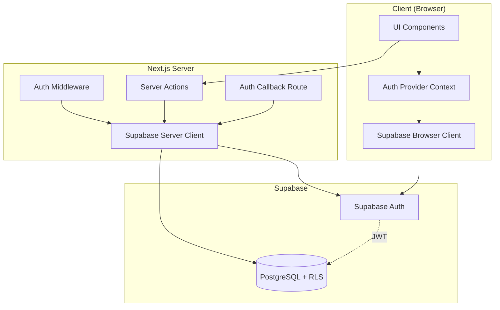

# Design Document: Supabase Auth Migration

## Overview

This design document describes the migration from next-auth with Google OAuth to Supabase Auth with email/password authentication. The migration addresses a critical security issue where RLS policies expect Supabase Auth JWTs but the application currently uses next-auth tokens.

The migration involves:
1. Removing all next-auth dependencies and code
2. Implementing Supabase Auth middleware for session management
3. Creating auth service functions for sign-in, sign-up, and sign-out
4. Updating UI components to use Supabase Auth state
5. Updating RLS policies to properly secure user data

## Architecture



## Components and Interfaces

### 1. Auth Service (`src/lib/services/auth.service.ts`)

Replaces the mock auth service with real Supabase Auth operations.

```typescript
interface AuthResult {
  success: boolean;
  error?: string;
  user?: {
    id: string;
    email: string;
  };
  requiresEmailConfirmation?: boolean;
}

interface AuthService {
  signInWithEmail(email: string, password: string): Promise<AuthResult>;
  signUp(email: string, password: string): Promise<AuthResult>;
  signOut(): Promise<AuthResult>;
  getUser(): Promise<{ id: string; email: string } | null>;
}

// Validation rules (applied before Supabase calls):
// - Email: Must match valid email format regex
// - Password: Minimum 6 characters

// Sign-up behavior:
// - If email confirmation is disabled: auto-sign-in user after registration
// - If email confirmation is enabled: return requiresEmailConfirmation: true
```

**Design Decision:** Client-side validation for email format and password length prevents unnecessary network calls and provides immediate feedback to users.

### 2. Auth Middleware (`src/middleware.ts`)

Handles session refresh and route protection.

```typescript
// Middleware configuration
const protectedRoutes = ['/admin'];
const authRoutes = ['/login'];

// Middleware behavior:
// 1. Refresh Supabase session on every request using getUser()
// 2. Update both request and response cookies with refreshed session
// 3. Redirect unauthenticated users from protected routes to /login
// 4. Optionally redirect authenticated users from /login to home
// 5. Clear invalid cookies if session refresh fails due to expired tokens

// Security note: Uses getUser() instead of getSession() for secure validation
// getUser() validates the JWT with Supabase Auth server
// getSession() only reads from cookies without validation
```

**Design Decision:** Using `getUser()` instead of `getSession()` ensures the JWT is validated server-side, preventing token tampering attacks.

### 3. Auth Provider Context (`src/components/providers/AuthProviderContext.tsx`)

Provides auth state to client components via React context.

```typescript
interface AuthContextValue {
  user: User | null;
  loading: boolean;
  signOut: () => Promise<void>;
}

interface User {
  id: string;
  email: string;
}

// Provider behavior:
// 1. On mount: Subscribe to onAuthStateChange listener
// 2. On auth state change: Update context value immediately
// 3. On unmount: Unsubscribe from auth state changes to prevent memory leaks
```

**Design Decision:** Using Supabase's `onAuthStateChange` listener ensures real-time auth state synchronization across all components without polling.

### 4. Auth Callback Route (`src/app/auth/callback/route.ts`)

Handles OAuth redirects, email verification links, and OTP token verification.

```typescript
// GET /auth/callback
// Query params:
//   - code: Auth code to exchange for session (OAuth/magic link flow)
//   - token_hash: OTP token hash for email verification
//   - type: Token type (e.g., 'email', 'recovery', 'signup')
//   - next: Redirect destination after success (defaults to '/')

// Flow 1: Code Exchange (OAuth/Magic Link)
// 1. Extract 'code' from query params
// 2. Call supabase.auth.exchangeCodeForSession(code)
// 3. On success: redirect to 'next' param or home
// 4. On failure: redirect to /login?error=exchange_failed

// Flow 2: OTP Token Verification (Email Confirmation)
// 1. Extract 'token_hash' and 'type' from query params
// 2. Call supabase.auth.verifyOtp({ token_hash, type })
// 3. On success: redirect to 'next' param or home
// 4. On failure: redirect to /login?error=verification_failed
```

**Design Decision:** Supporting both code exchange and OTP verification in a single callback route simplifies the auth flow and allows for future OAuth provider additions without route changes.

### 5. Login Form (`src/components/auth/LoginForm.tsx`)

Updated to use Supabase Auth with email/password and optional registration.

```typescript
interface LoginFormProps {
  mode?: 'signin' | 'signup';
}

// Form fields:
// - email: string (required, valid email format)
// - password: string (required, min 6 characters)
```

### 6. Header Component (`src/components/layout/Header.tsx`)

Updated to display Supabase Auth state.

```typescript
// Auth UI states:
// - Loading: Show skeleton/spinner
// - Authenticated: Show user email + sign out button
// - Unauthenticated: Show sign in button
```

## Data Models

### User Session (Supabase Auth)

```typescript
interface Session {
  access_token: string;
  refresh_token: string;
  expires_in: number;
  expires_at: number;
  token_type: string;
  user: User;
}

interface User {
  id: string;
  aud: string;
  role: string;
  email: string;
  email_confirmed_at: string | null;
  created_at: string;
  updated_at: string;
}
```

### RLS Policy JWT Claims

```typescript
// auth.jwt() returns:
interface JWTClaims {
  sub: string;        // User ID
  email: string;      // User email
  role: string;       // User role
  aud: string;        // Audience
  exp: number;        // Expiration timestamp
  iat: number;        // Issued at timestamp
}
```


## Correctness Properties

*A property is a characteristic or behavior that should hold true across all valid executions of a system—essentially, a formal statement about what the system should do. Properties serve as the bridge between human-readable specifications and machine-verifiable correctness guarantees.*

### Property 1: Middleware Session Refresh

*For any* HTTP request to the application, the middleware SHALL refresh the Supabase session and update both request and response cookies with the refreshed session data.

**Validates: Requirements 2.1, 2.2**

### Property 2: Protected Route Redirection

*For any* unauthenticated request to a protected route (e.g., /admin/*), the middleware SHALL redirect to /login with the original URL as a callback parameter.

**Validates: Requirements 2.3**

### Property 3: Authentication Error Privacy

*For any* failed authentication attempt with invalid credentials, the Auth_Service SHALL return a generic error message that does not reveal whether the email or password was incorrect.

**Validates: Requirements 3.4**

### Property 4: Email Format Validation

*For any* string that is not a valid email format, the Auth_Service SHALL reject the authentication request before making any network calls to Supabase_Auth.

**Validates: Requirements 3.5**

### Property 5: Password Strength Validation

*For any* password that does not meet minimum requirements (less than 6 characters), the Auth_Service SHALL return a validation error without calling Supabase_Auth.

**Validates: Requirements 4.5**

### Property 6: Sign Out Cookie Cleanup

*For any* successful sign out operation, the System SHALL clear all Supabase auth cookies from the browser.

**Validates: Requirements 5.2**

### Property 7: Header Auth State Display

*For any* authenticated user, the Header component SHALL display the user's email address and a sign out button.

**Validates: Requirements 6.1**

### Property 8: Auth Provider State Propagation

*For any* auth state change (sign in, sign out, session refresh), the Auth_Provider SHALL immediately notify all subscribed child components with the updated state.

**Validates: Requirements 7.1, 7.2**

### Property 9: RLS Policy Enforcement

*For any* database operation (SELECT, INSERT, UPDATE, DELETE) on user_favorites, the RLS_Policy SHALL only allow access to rows where auth.jwt() email matches the user_email column.

**Validates: Requirements 8.1, 8.2, 8.3, 8.4**

## Error Handling

### Authentication Errors

| Error Scenario | User Message | Technical Action |
|----------------|--------------|------------------|
| Invalid credentials | "Invalid email or password" | Return generic error, log attempt |
| Email already registered | "An account with this email already exists" | Return error, suggest sign in |
| Weak password | "Password must be at least 6 characters" | Client-side validation |
| Invalid email format | "Please enter a valid email address" | Client-side validation |
| Network error | "Unable to connect. Please try again." | Retry with exponential backoff |
| Session expired | Silent refresh or redirect to login | Clear cookies, redirect |

### Middleware Error Handling

```typescript
// Error handling flow in middleware
try {
  const { data: { user }, error } = await supabase.auth.getUser();
  
  if (error) {
    // Clear invalid session cookies
    // Allow request to continue (user will be unauthenticated)
  }
  
  if (!user && isProtectedRoute(pathname)) {
    // Redirect to login
  }
} catch (error) {
  // Log error, allow request to continue
}
```

### Callback Route Error Handling

```typescript
// Error scenarios for auth callback
const errorRedirect = (error: string) => 
  NextResponse.redirect(`${origin}/login?error=${encodeURIComponent(error)}`);

// Handle missing code
if (!code && !token_hash) {
  return errorRedirect('missing_code');
}

// Handle code exchange failure
const { error } = await supabase.auth.exchangeCodeForSession(code);
if (error) {
  return errorRedirect('exchange_failed');
}
```

## Testing Strategy

### Unit Tests

Unit tests will verify specific examples and edge cases:

1. **Auth Service Tests**
   - Sign in with valid credentials returns session
   - Sign in with invalid credentials returns error
   - Sign up with new email creates account
   - Sign up with existing email returns error
   - Sign out clears session

2. **Component Tests**
   - Header displays user email when authenticated
   - Header displays sign in button when unauthenticated
   - LoginForm validates email format
   - LoginForm validates password length

3. **Middleware Tests**
   - Protected routes redirect unauthenticated users
   - Public routes allow unauthenticated access
   - Session cookies are refreshed on requests

### Property-Based Tests

Property-based tests will verify universal properties using fast-check:

1. **Email Validation Property**
   - Generate random strings, verify invalid emails are rejected
   - Generate valid email patterns, verify they are accepted

2. **Password Validation Property**
   - Generate passwords of various lengths
   - Verify passwords < 6 chars are rejected
   - Verify passwords >= 6 chars are accepted

3. **Error Message Privacy Property**
   - Generate various invalid credential combinations
   - Verify error messages never reveal which field was wrong

4. **RLS Policy Property**
   - Generate random user emails and favorites
   - Verify users can only access their own data

### Test Configuration

- Testing framework: Vitest
- Property-based testing library: fast-check
- Minimum iterations per property test: 100
- Test tag format: `Feature: supabase-auth-migration, Property N: {property_text}`

### Integration Tests

Integration tests will verify end-to-end flows:

1. **Full Authentication Flow**
   - Sign up → Email confirmation → Sign in → Access protected route → Sign out

2. **Session Persistence**
   - Sign in → Close browser → Reopen → Verify session persists

3. **RLS Integration**
   - Sign in as User A → Create favorite → Sign in as User B → Verify User B cannot see User A's favorites

## Environment Variables

The migration requires updating environment variables to remove next-auth configuration and ensure Supabase Auth variables are properly documented.

### Required Variables (Supabase Auth)
```
NEXT_PUBLIC_SUPABASE_URL=your-supabase-url
NEXT_PUBLIC_SUPABASE_ANON_KEY=your-supabase-anon-key
```

### Variables to Remove (next-auth)
```
NEXTAUTH_SECRET          # No longer needed
NEXTAUTH_URL             # No longer needed
GOOGLE_CLIENT_ID         # No longer needed (OAuth removed)
GOOGLE_CLIENT_SECRET     # No longer needed (OAuth removed)
```

**Design Decision:** Email/password authentication eliminates the need for OAuth provider credentials, simplifying deployment and reducing external dependencies.

## File Changes Summary

### Files to Create
- `src/app/auth/callback/route.ts` - Auth callback handler for email verification and OAuth redirects

### Files to Modify
- `src/middleware.ts` - Replace next-auth with Supabase Auth session management
- `src/lib/services/auth.service.ts` - Implement real Supabase Auth operations
- `src/components/providers/AuthProviderContext.tsx` - Use Supabase Auth state
- `src/components/layout/Header.tsx` - Use Supabase Auth state for UI
- `src/components/auth/LoginForm.tsx` - Use Supabase Auth service for sign-in/sign-up
- `package.json` - Remove next-auth dependency
- `.env.example` - Document only required Supabase environment variables

### Files to Delete
- `src/app/api/auth/[...nextauth]/route.ts` - next-auth API route (Requirement 11.1)
- `src/lib/auth.ts` - next-auth configuration (Requirement 11.2)

**Design Decision:** Complete removal of next-auth files ensures no orphaned code remains and prevents confusion about which auth system is active.

### Database Changes
- Update RLS policies on `user_favorites` table to use proper Supabase Auth JWT claims via `auth.jwt()->>email`
